# 数字滤波器和数字锁相放大器

**说明：**

- 总结数字滤波器、数字锁相放大器相关的算法以及使用
- python脚本在`JupyterScript`文件夹中
- 日期：2020.6.23


# 一、数字滤波器

 - 从下面的结果可以看出，滤波器有很明显的相移
 - 需要高阶滤波器时，sos filter的数值稳定性更好，更加通用

## 1.1 数字低通滤波器

**使用方式：**

``` python
#数字低通滤波器的使用
order   = 8
cutoff  = 150

#butter filter
lp_b, lp_a = signal.butter(order, cutoff, 'low', fs=fs)       
signal_out = signal.lfilter(lp_b, lp_a, signal_in)

#sos filter
sos         = signal.butter(order, cutoff, btype='low', fs=fs, output='sos')
signal_out  = signal.sosfilt(sos, signal_in)

```


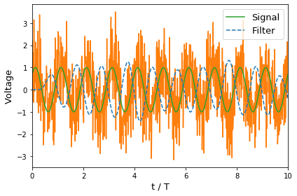

## 1.2 数字带通滤波器

**使用方式：**


```python
#带通滤波
order   = 8
lowcut  = 80
highcut = 120
#sos filter
sos        = signal.butter(order, [lowcut, highcut], btype='band', fs=fs, output='sos')
signal_out = signal.sosfilt(sos, signal_vec)
```

这里没有使用signal.lfilter，因为高阶时，该方法数值不稳定，出现了发散。


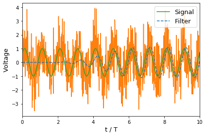


# 二、数字锁相放大器

带有噪声的交流信号：
$$
V(t) = A\sin (\Omega t + \phi) + \delta V(t)
$$
其中，$\delta V(t)$表示噪声

与参照信号相乘：
$$
\begin{cases}
V(t) \times 2\sin(\Omega t) = A\cos \phi - A\cos(2\Omega t + \phi) + 2\delta V(t) \sin(\Omega t)
\\
V(t) \times 2\cos(\Omega t) = A\sin \phi + A\sin(2\Omega t + \phi) + 2\delta V(t) \cos(\Omega t)
\end{cases}
$$

上面的操作可以看成是对数据做了一次映射，映射结果的组成：直流 + 交流 。其中，直流是我们的目标值，而交流部分包含噪声，倍频（通常信号源有直流分量，所以与参照信号相乘后，还会形成新的基频成分）。最后，通过求平均，除去交流部分，留下直流分量。从这个角度来看，锁相放大器能测量弱信号，依然是根据“多次实验求平均”这一基本原理来实现的（相当朴素啊）。

通常，锁相放大器还会将上面的结果通过低通滤波器，然后才输出结果。如果是数字锁相放大器，其实都可以不用进行滤波，直接将上面与参照信号相乘的结果进行求平均，输出结果。因为低通滤波器不会影响数据中的直流分量，该直流分量在上面的乘法操作后就被确定了，无法改变。当然，如果是模拟锁相放大器，是必须要低通滤波器的，其作用就是对数据求平均，并方便最终读数。至于为什么数字锁相放大器要使用低通滤波器，可能是有其他方面的考虑，比如输出数字的变化可以直观反映待测频率附近的噪声大小。又或者这样的锁相放大器可以等效为带有放大效果的带通滤波器？

## 2.1 生成带噪声的电压信号


```python
#生成带噪声的信号
def signal_func(t_vec, freq, amplitude, phase, noise_amplitude):
    signal_vec = amplitude*np.sin(2*np.pi*freq*t_vec + phase/180*np.pi)
    noise_vec  = np.random.normal(0, noise_amplitude, len(t_vec))
    return signal_vec + noise_vec
```


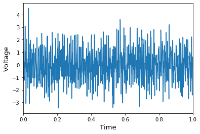


## 2.2 相乘后直接平均


```python
#与参照函数相乘，然后平均
X = np.average(2*signal_vec*np.sin(2*np.pi*t_vec*freq))
Y = np.average(2*signal_vec*np.cos(2*np.pi*t_vec*freq))

print('R: ', np.abs(X+1j*Y))
print('Phase: ', np.angle(X+1j*Y)*180/np.pi)
```
**Output:**

    R:  0.9813024743316513
    Phase:  39.04809862524686


## 2.3 相乘+滤波


```python
#low pass filter
order  = 4
cutoff = 20
b,a    = signal.butter(order, cutoff, 'low', fs=fs) 

sX  = 2*signal.lfilter(b,a,signal_vec*np.sin(2*np.pi*t_vec*freq))  #相乘并滤波
sY  = 2*signal.lfilter(b,a,signal_vec*np.cos(2*np.pi*t_vec*freq))  #相乘并滤波

#average
X  = np.average(sX)
Y  = np.average(sY)

print('R: ', np.abs(X+1j*Y))
print('Phase: ', np.angle(X+1j*Y)*180/np.pi)
```

**Output:**

    R:  0.9640100681479425
    Phase:  39.31475856903451


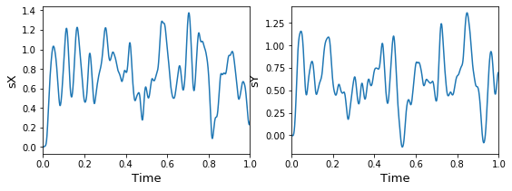


# 三、模拟实验

## 3.1 用锁相放大器测试数字低通滤波器

将周期信号经过低通滤波器处理，再用数字锁相放大器测量输出信号。


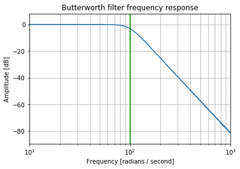


## 3.2 用锁相放大器测试数字带通滤波器

将周期信号经过带通滤波器处理，再用数字锁相放大器测量输出信号。


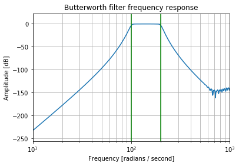


## 3.3 模拟锁相放大器测量周期信号的波形

**说明：**

- 完整代码见：

  - JupyterScript/lockin_periodicWaveformRecover.ipynb  #数值模拟该过程

  - JupyterScript/SquareWaveformRecover_AWG_UHF.ipynb

    #使用仪器AWG（任意波形发生器）和UHF（锁相放大器）执行该实验

- 日期：2020.12.9


**周期信号傅里叶级数展开：**
$$
\begin{cases}
f = \sum_n C_n e^{-in\Omega t}
\\
C_n = \int_0^{t_f} \frac{dt}{t_f} e^{in\Omega t} f
\end{cases}
$$

其中，$t_f$为锁相的积分时间，应该远大于$2\pi/\Omega$。

傅里叶级数与锁相测量结果的关系：

$$
\begin{cases}
Cn &=& \int \frac{dt}{t_f} (\cos(n\Omega t) + i\sin(n\Omega t)) f
\\
&=& \int \frac{dt}{t_f} \cos(n\Omega t) f+ i \int \frac{dt}{t_f} \sin(n\Omega t) f
\\
&=& \frac12 Y_n + \frac i2 X_n
\\
C_{-n} &=& C_n^*
\end{cases}
$$

其中，$X_n$，$Y_n$即为锁相的测量结果。


### 3.3.1. 待测量的方波信号


```python
def squareSmooth_func(t_vec, T, V0):
    delta_t  = T/50
    return 1/(1+np.exp( (t_vec-T/4*3)/delta_t)) * (1 - 1/(1+np.exp( (t_vec-T/4)/delta_t)) ) * V0

def squarePeriodic_func(t_vec, T, V0):
    N_period = int(float(np.round( ( (t_vec[-1] - t_vec[0]) / T ) )))
    N_singleT= int( t_vec.size / N_period)
    
    #定义单个周期中的信号
    tSingle_vec = np.linspace(0, T, N_singleT+1)[:-1] #扔掉末尾的点
    VSingle_vec = squareSmooth_func(tSingle_vec, T, V0)
    
    #将所有周期的信号连接起来
    output = np.array([])
    for n in range(N_period):
        output = np.concatenate( (output, VSingle_vec) )
        
    return output
```


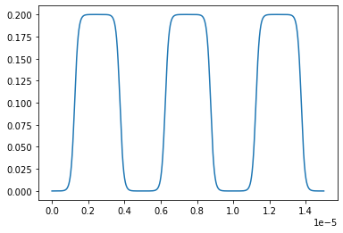
    


### 3.3.2. 锁相测量 Cn


```python
def Lockin_XY_func(signal_vec, t_vec, freq):
    sX    = 2*signal_vec*np.sin(2*np.pi*t_vec*freq)
    sY    = 2*signal_vec*np.cos(2*np.pi*t_vec*freq)
    sX    = np.sum(sX) / len(sX)
    sY    = np.sum(sY) / len(sY)
    
    return sX,sY
```

#### Signal


```python
t_vec = np.linspace(0,T*1000, 100001)[:-1]
g_vec = squarePeriodic_func(t_vec, T, V0)
```

#### Measurement


```python
Nn     = 10
Cn_vec = np.zeros(Nn, dtype=complex)
```


```python
Cn_vec[0] = np.average(g_vec)
```


```python
#AC measurement
for n in range(1,Nn):
    #UHF_ready_check()
    [X, Y]    = Lockin_XY_func(g_vec, t_vec, n*freq)
    Cn_vec[n] = 0.5j*X + 0.5*Y
```


```python
[X, Y]    = Lockin_XY_func(g_vec, t_vec, 1*freq)
```


### 3.3.3. 还原信号


```python
squareRecover_vec = np.zeros(t_vec.size)

#DC recover
squareRecover_vec = squareRecover_vec + Cn_vec[0]

#AC recover
for n in range(1, Cn_vec.size):
    omega             = 2*np.pi*freq
    Cn                = Cn_vec[n]
    squareRecover_vec = squareRecover_vec + np.exp(-1j*n*omega*t_vec) * Cn + np.exp(1j*n*omega*t_vec) * Cn.conj()
```


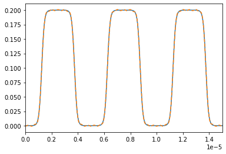
    

# 四、补充内容

## 4.1 数据处理时，直接平均与滤波后再平均？

如果信号的组成是直流+噪声：$\bar{V} + \delta V$，用采集卡测量到了一组值$[V_n, ...]$。将测量数据通过数字低通滤波器处理，下面是处理前和处理后的数据分布。看起来滤波后的数据分布更窄，噪声更小。是不是通过低通滤波器后，再对数据求平均，得到的$\bar V$值更准确？

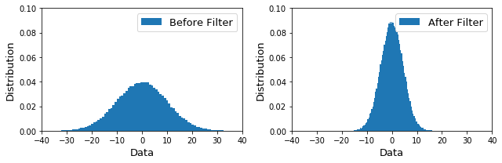


**结论：**

- 两种方式得到的直流分量$\bar V$是一样的，数字滤波器不会提高精度
- 只有增加测量次数，才能提高精度，使测量结果向真实值逼近

**原因：**

因为数字低通滤波器不会改变$[V_n, ...]$中的直流分量，只是将该组数据的分布向均值靠拢，看起来噪声变小，但均值不会变化。上面两个分布的宽度不一样，但其均值（中心值）是一样的。所以在已经得到了测量数据后，使用数字滤波器的测量方法并不能减小直流$ \bar V $误差。

下面是通过实验数据的方差来证明两种方式的精度确实是一样的。图中，N表示每次实验中，采集的数据点。然后后重复实验，查看测量的$\overline V$分布方差随实验数据量的变化。


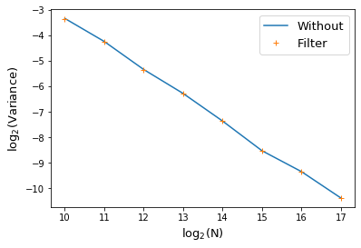


## 4.2  一阶RC滤波器


理论分析：

- https://www.embeddedrelated.com/showarticle/590.php
- 从时域微分方程以及Transfer Function的角度分析该系统
- Transfer Function应该是拉普拉斯变换方面的，暂时跳过

算法实现（数字滤波器）：

- https://www.embeddedrelated.com/showarticle/779.php


## 4.3 高阶数字滤波器的数值稳定性

**结论**：在使用高阶数字滤波器时，`sosfilt`的稳定性更好，`butter`可能会发散

**资料**：https://stackoverflow.com/questions/21862777/bandpass-butterworth-filter-frequencies-in-scipy

**Note**：

- Don't use `b, a = butter` for high-order filters, whether in Matlab or SciPy or Octave.  Transfer function format [has numerical stability problems](http://www.mathworks.com/products/demos/shipping/control/GSModelTypeConversions.html?product=CT#9),  because some of the coefficients are very large while others are very  small.  This is why we changed the filter design functions [to use zpk format internally](https://github.com/scipy/scipy/pull/3085).  To see the benefits of this, you need to use `z, p, k = butter(output='zpk')` and then work with poles and zeros instead of numerator and denominator
- Don't do high-order digital filters in a single stage.  This is a  bad idea no matter what software or hardware you're implementing them  on.  Typically it's best to break them up into [second-order sections](https://ccrma.stanford.edu/~jos/fp/Series_Second_Order_Sections.html).  In Matlab, you can use [zp2sos](http://www.mathworks.com/help/signal/ref/zp2sos.html) to generate these automatically.  In SciPy, you can use `sos = butter(output='sos')` and then filter using [`sosfilt()`](https://docs.scipy.org/doc/scipy/reference/generated/scipy.signal.sosfilt.html) or [`sosfiltfilt()`](https://docs.scipy.org/doc/scipy/reference/generated/scipy.signal.sosfiltfilt.html).  This is the recommended way to filter for most applications

```python
import numpy as np
from scipy import signal
import matplotlib.pyplot as plt
from tqdm import tqdm

def signal_func(t_vec, freq):
    return np.sin(2*np.pi*freq*t_vec) 

#设置带通滤波器
order   = 10
lowcut  = 100
highcut = 200

#输入信号
freq  = 1000
tf    = 1
fs    = freq*4
Nt    = tf*fs+1
t_vec = np.linspace(0, tf, Nt)
signal_in = signal_func(t_vec, freq)


#lfilter滤波
b, a          = signal.butter(order, [lowcut, highcut], btype='band', fs=fs)
signalBa_out  = signal.lfilter(b, a, signal_in)

#soffilt滤波
sos           = signal.butter(order, [lowcut, highcut], btype='band', fs=fs, output='sos')
signalSOS_out = signal.sosfilt(sos, signal_in)


#==== plot ====
plt.figure(figsize=(10,4))

plt.subplot(1,2,1)
plt.plot(t_vec, signalBa_out)
plt.xlabel('t', fontsize=13)
plt.ylabel('Signal Out', fontsize=13)
plt.title('lfilter', fontsize=13)

plt.subplot(1,2,2)
plt.plot(t_vec, signalSOS_out)
plt.xlabel('t', fontsize=13)
plt.ylabel('Signal Out', fontsize=13)
plt.title('sosfilter', fontsize=13)

plt.tight_layout()
#plt.savefig("pic_name.png", format='png', dpi=200)
```

**计算结果：**

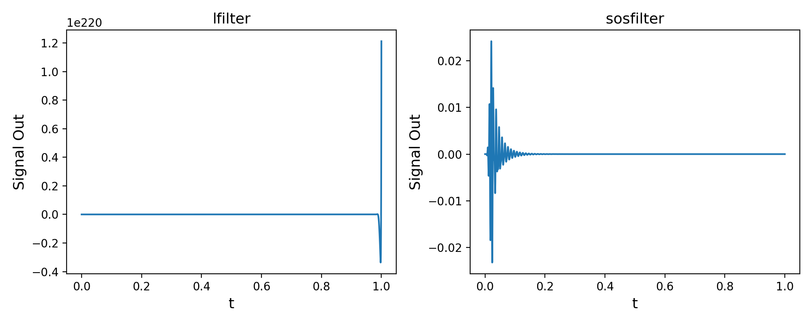


## 4.4 lfilter的算法


https://docs.scipy.org/doc/scipy/reference/generated/scipy.signal.lfilter.html

```python
'''
#algrithm:
a[0]*y[n] = b[0]*x[n] + b[1]*x[n-1] + ... + b[M]*x[n-M]
                      - a[1]*y[n-1] - ... - a[N]*y[n-N]
'''

import numpy as np
from scipy import signal

def my_lfilter(b,a, sig_vec):
    #a[0] = 1
    a = a/a[0]
    b = b/a[0]
    #filter
    output = np.zeros(len(sig_vec))
    for n in range(len(sig_vec)):
        for na in range(1,len(a)):
            if ((n-na)<0): break
            output[n] = output[n] - a[na]*output[n-na]
        for nb in range(len(b)):
            if ((n-nb)<0): break
            output[n] = output[n] + b[nb]*sig_vec[n-nb]
    return output

#signal
Nt      = 6
sig_vec = np.random.random(Nt)

#filter parameters
LP_order = 1
cutoff   = 0.1
b, a     = signal.butter(LP_order, cutoff, 'low', analog=False)

#filter the signal
print("Numpy lfilter: ", signal.lfilter(b,a,sig_vec))
print("My lfilter:    ", my_lfilter(b,a,sig_vec))
```

