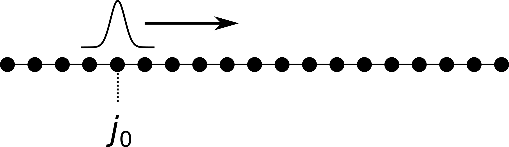
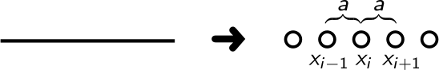
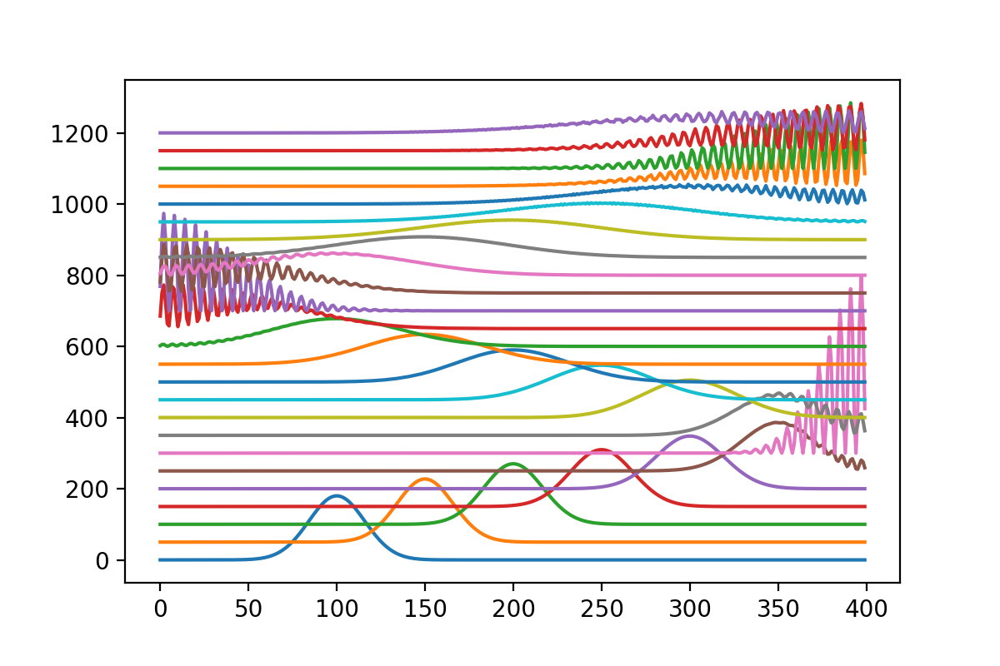

# 波函数在无限深势阱中的演化

[2021.1.2]


**Ref:**

- [2.5. Solving one-body problems](https://kwant-project.org/extensions/tkwant/tutorial/onebody#infinite-systems) 

  本小节主要为了重复tkwant示例：2.5.1. Finite systems 

  

- kwant示例：[2.2. First steps: setting up a simple system and computing conductance](https://kwant-project.org/doc/1/tutorial/first_steps)

- 简单了解`solve_ivp`库函数的使用：[Python:Ordinary Differential Equations](https://pundit.pratt.duke.edu/wiki/Python:Ordinary_Differential_Equations)

- tkwant文档，关于`onebody.solver`：[4.3. tkwant.onebody.solvers – Solvers for ordinary differential equations](https://kwant-project.org/extensions/tkwant/reference/tkwant.onebody.solvers)

- *Tkwant: a software package for time-dependent quantum transport*

  第10页：A. Solving one-body problems


## 一、空间离散化

一维薛定谔方程：
$$
i\hbar \ \partial_t \Psi = H \Psi
$$
其中，哈密顿量：$H=-\frac{\hbar^2}{2m} \ \part_x^2 + V$

### 1.1 一维格点

一维连续空间离散化为格点：



为了计算波函数对空间的二阶导数，先计算第 i-1 和 i个格点中间点的一阶导数：
$$
\part_x \Psi(x=\frac{x_i+x_{i-1}}{2}) \approx \frac{\Psi_i - \Psi_{i-1}}{a}
$$
注意，上式的左边，格点$\frac{x_i+x_{i+1}}{2}$ 并不存在，它为了方便计算二阶导数而假想的格点。但等式的右边，都是实际存在的格点。

波函数对空间的二阶导数：
$$
\begin{align}
\part_x^2 \Psi(x=x_i) 
&\approx \frac{\part_x \Psi(x=\frac{x_i+x_{i+1}}2) - \part_x \Psi(x=\frac{x_i+x_{i-1}}2)} {a}
\\
&\approx \frac{\Psi_{i-1} - 2\Psi_i + \Psi_{i+1}}{a^2}
\end{align}
$$


### 1.2 哈密顿量

离散化的哈密顿量：
$$
i\hbar \ \part_t\Psi_i = \frac{\hbar^2}{2ma^2} (-\Psi_{i-1}+2\Psi_i-\Psi_{i+1}) + V_i\Psi_i
$$
无量纲化：

- $\hbar=1$
- $a=1$ ，作为长度单位
- $\frac{\hbar^2}{2ma^2}=1$ ，作为能量单位

注意，上述几个量确定后，时间t，质量m的单位也都被确定了。

离散后的哈密顿量：
$$
H = \begin{bmatrix} 
     &\ddots\\
     & -1 &  2+V_i &-1 \\
     &&  -1 &  2+V_i &-1 &\\ 
     &&&&\ddots\\
    \end{bmatrix}
$$


### 1.3 边界条件

上面的哈密顿量仍然无法直接使用，需要利用边界条件进行截断，成为有限大小的矩阵。

在无限深势阱的外部，波函数全部为0，所以边界处的薛定谔方程：
$$
\begin{cases}
i \ \part_t\Psi_0 =  2\Psi_0-\Psi_{1}
\\
i \ \part_t\Psi_{N-1} =  -\Psi_{N-2}+2\Psi_{N-1}
\end{cases}
$$
注意:

- 我们进行空间离散化时，势阱内有N个格点，从0到N-1进行编号（与python的默认编号方式一致）。
- 势阱内部的势场$V=0$

截断后的哈密顿量：
$$
H = \begin{bmatrix} 
     2  & -1 \\
     -1 &  2 &-1 \\
     &&\ddots\\
     
     &&  -1 & 2 &-1 \\ 
     &&& -1 & 2
    \end{bmatrix}
$$

## 二、时域积分

经过上面的处理，我们将偏微分方程转化为向量的常微分方程：
$$
i \ \partial_t \Psi = H \Psi
$$
其中，$H$为$N\times N$ 的矩阵，$\Psi$为N维列向量。

接下来，我们知道系统的初态$\Psi_0$后，就可以直接使用scipy的库函数`solve_ivp`进行数值积分，得到该波函数的时域演化。`solve_ip`的简单教程：[Python:Ordinary Differential Equations](https://pundit.pratt.duke.edu/wiki/Python:Ordinary_Differential_Equations)

**关于solve_ip的Notes / Troubleshooting：**

 - The initial y value is assume to be at the start of the time span t_span, which means not neessarily time 0.

 - The initial values need to be in "an array-like" thing; either a list or an array. This is true even if there is a single initial condition. If you are getting an error:


## 三、示例程序

```python
import numpy as np
import scipy
import matplotlib.pyplot as plt
from scipy.integrate import solve_ivp

#---------------------------------------------------------------------
# Define spacial and temporal grids.
xn_vec   = np.arange(400)
t_vec    = np.arange(0, 1201, 50)

# Initial condition.
psi0_vec = np.exp(- 0.001 * (xn_vec - 100)**2 + 1j * np.pi/6 * xn_vec) #向右平移了100个格点

#---------------------------------------------------------------------
# Hamiltonian matrix.
diag_vec    = 2 * np.ones(len(xn_vec))
offdiag_vec = - np.ones(len(xn_vec) - 1)
H0          = scipy.sparse.diags([diag_vec, offdiag_vec, offdiag_vec], [0, 1, -1])

#---------------------------------------------------------------------
# Solve differential equation
def dfdt_func(t,psi_vec):
    return H0@psi_vec*-1j
sol = solve_ivp(dfdt_func, [t_vec[0], t_vec[-1]], psi0_vec, t_eval=t_vec) 

#---------------------------------------------------------------------
# plot the result.
for n_t in range(t_vec.size):
    time        = t_vec[n_t]
    psi_vec     = sol.y[:,n_t]
    density_vec = np.real(psi_vec * psi_vec.conjugate())
    # Prefactor and shift for representation purpose.
    plt.plot(xn_vec, 180 * density_vec + time)
```

 **计算结果：**



## 四、额外说明

- 一开始，查看tkwant的文档、源代码，想知道他们如何解决时域演化问题。根据[4.3. tkwant.onebody.solvers – Solvers for ordinary differential equations](https://kwant-project.org/extensions/tkwant/reference/tkwant.onebody.solvers)，转到python ODE库，查看`solve_ivp`的官方说明，该库函数是为了解决如下的数学问题：

  ```
  dy / dt = f(t, y)
  y(t0) = y0
  ```

  乍一看，这不是我所需要的。但饶了一大圈后，回头才发现，上述方程中，`y` 默认是一个向量，并不是一个标量。这才明白，在我们的问题中，空间离散化后，波函数变成了一个向量（一维，二维，三维都一样）。波函数的演化就转换为了向量的常微分方程，直接调用成熟的数学库，即可求解。