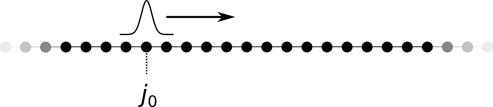
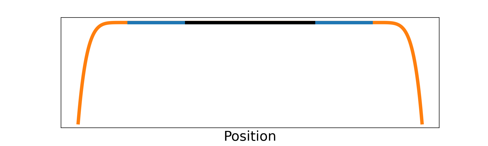
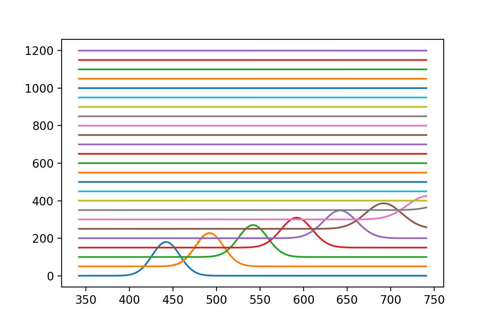

# 波函数在平直空间的演化

[2021.1.3]

上一小节中，我们利用波函数在势阱外全部为0这一性质（边界条件），将无穷大的哈密顿量截断，成为程序上能直接使用的矩阵。从计算结果看到，波函数在势阱边缘被全部反弹。但在散射问题中（或者输运问题），出射波在平直空间中，将传播到无穷远，没有反射。在这种情况下，为了截断哈密顿量，我们引入吸收势。


**Ref:**

- [2.5. Solving one-body problems](https://kwant-project.org/extensions/tkwant/tutorial/onebody)

  本小节主要为了重复tkwant示例：2.5.2. Infinite systems 中的第一个例子

  

- Tkwant: a software package for time-dependent quantum transport.

  文章第8页，讲解Sink Algorithm

- Tkwant: a software package for time-dependent quantum transport.

  文章末尾的APPENDIX B，说明如何设置吸收势的参数（优化问题）。

- Numerical Solution of the Time-Dependent 1D-Schrödinger Equation using Absorbing Boundary Conditions.

  这是一篇毕业论文，作者：Christoph Wachter。我并没有仔细看，但觉得很有意思，所以也放在这儿（其实是一个很好的本科生科研训练项目）。


## 一、物理模型

如下图所示，我们仍然是将整个系统放到了无限深势阱中。在势阱中，空间被分成了三部分：

- 中间的黑色表示散射区，包含变化的势场
- 两侧的橙色表示吸收势：$\Sigma(x) = i(n+1)Ax^n$。其中，i为虚数单位，x为空间坐标，n为吸收势的阶数（一般取n=6），A为系数。对吸收势性能的判断标准是，对波函数的反射尽量小。各个参数的选取（包括A，n，吸收势区间长度），属于优化问题，不同的情况有不同的选择。
- 散射区两侧的蓝色部分为缓冲区。一般情况下，波函数中，波矢k较大的快波，反射很少。k较小的慢波，就会有明显的反射成分，为了减小它们的影响，设置了缓冲区，这样，在有限的演化时间内（tkwant中的tmax参数），被反射的慢波不会到达中间的黑色部分（散射区），也就不会对我们关心的演化过程产生影响。



<div align=center>势阱中的势场变化。</div>


## 二、示例程序

**说明：**

- 本小节主要目的是演示吸收势的引入，所以为了简化问题，在该程序中，一些参数，吸收区和缓冲区的长度，吸收势系数A，都是直接使用tkwant示例中的参数。

```python
import numpy as np
import scipy
import matplotlib.pyplot as plt
from scipy.integrate import solve_ivp

#--------------------------------------------------------------------------
# Define spacial and temporal grids.
num_lead_cells   = 160    #虚势区间长度
num_buffer_cells = 182    #用于缓冲长波的区间长度
num_center_cells = 400    #散射区长度
num_total_cells  = num_lead_cells*2 + num_buffer_cells*2 + num_center_cells
#散射区对应的格点位置
pos_center_vec   = np.arange(num_lead_cells + num_buffer_cells,\
                             num_total_cells-num_lead_cells-num_buffer_cells,
                             1)

#--------------------------------------------------------------------------
xn_vec   = np.arange(num_total_cells)
t_vec    = np.arange(0, 1201, 50)
# Initial condition.
n_psiShift = 100 +  num_lead_cells + num_buffer_cells
psi0_vec   = np.exp(- 0.001 * (xn_vec - n_psiShift)**2 + 1j * np.pi/6 * xn_vec) #向右平移了100个格点

#--------------------------------------------------------------------------
sigma_degree   = 6
sigma_strength = 37
sigma_vec      = -1j*(sigma_degree + 1) *sigma_strength * (np.arange(num_lead_cells)/num_lead_cells)**sigma_degree / num_lead_cells

#--------------------------------------------------------------------------
# Hamiltonian matrix.
diag_vec    = 2 * np.ones(num_buffer_cells*2 + num_center_cells)
diag_vec    = np.concatenate( ((sigma_vec+2*np.ones(sigma_vec.size))[::-1], diag_vec) )
diag_vec    = np.concatenate( (diag_vec, sigma_vec+2*np.ones(sigma_vec.size)) )
offdiag_vec = - np.ones(len(xn_vec) - 1)
H           = scipy.sparse.diags([diag_vec, offdiag_vec, offdiag_vec], [0, 1, -1])

#--------------------------------------------------------------------------
# %% Solve differential equation
def dfdt_func(t,psi_vec):
    return H@psi_vec*-1j

sol = solve_ivp(dfdt_func, [t_vec[0], t_vec[-1]], psi0_vec, t_eval=t_vec) 

# Loop over the timesteps and plot the result.
for n_t in range(t_vec.size):
    time        = t_vec[n_t]
    psi_vec     = sol.y[:,n_t]
    density_vec = np.real(psi_vec * psi_vec.conjugate())
    # Prefactor and shift for representation purpose.
    plt.plot(xn_vec[pos_center_vec], 180 * density_vec[pos_center_vec] + time)
```

**Ouput:**

