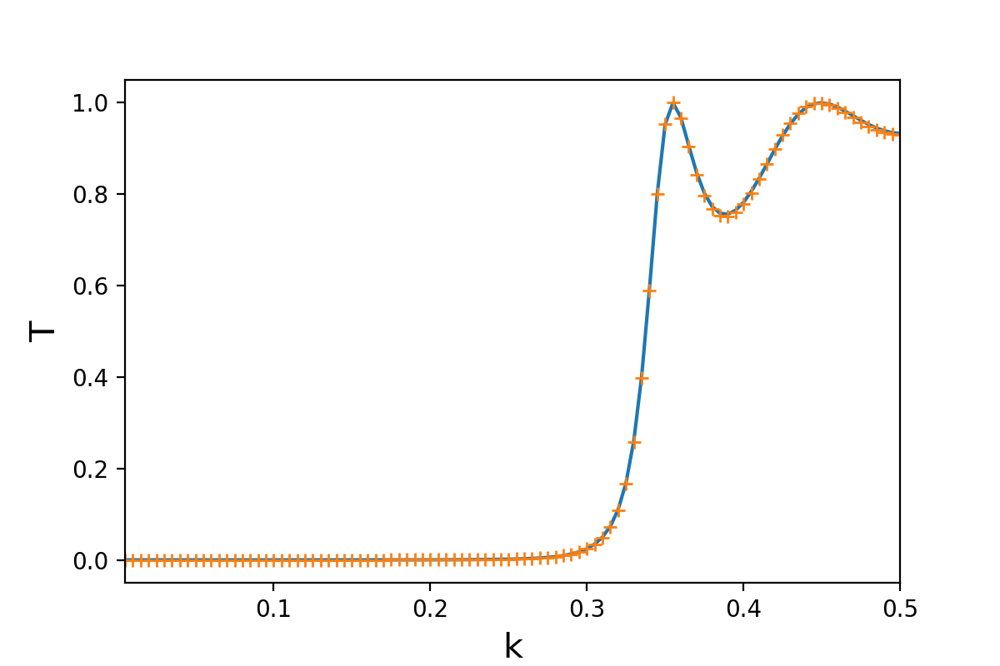

# 定态散射

[2021.1.4]

前面小节中，我们解释了一个局域波包的时域演化，但量子输运中，一般研究对象是散射态，即波函数在lead（连接散射区的导线）中是平面波，且延伸到无穷远。不过，在计算时域演化之前，我们需要先得到系统的初态。


## 一、物理模型对应的数学方程


### 1.1 方程离散化

**定态薛定谔方程：**
$$
\bigg[-\frac{\hbar^2}{2m}\partial_x^2 +V(x) \bigg] \Psi_x = E \Psi_x
$$

**离散化：**

$$
-\frac{\hbar^2}{2ma^2}  \Psi_{n-1} + (2\frac{\hbar^2}{2ma^2}+V_n-E)\Psi_n - \frac{\hbar^2}{2ma^2}\Psi_{n+1}  =0
$$

### 1.2 边界条件：

以k>0为例，即从散射区的左边入射平面波，假设系统的格点总数为N个。

**左边边界条件：**


左边lead中波函数的表达式：
$$
  \Psi^L = \frac{1}{\sqrt{V}} \bigg(e^{ikx} + r e^{-ikx} \bigg)
$$

其中，V表示速度，这里作为归一化系数，在输运问题中，一般采用流归一化。

离散化后，最左边的两个格点的波函数：
$$
\begin{cases}
\Psi_0 = \frac{1}{\sqrt{V}} (1+r)
\\
\Psi_1 = \frac{1}{\sqrt{V}} (e^{ika} + re^{-ika})
\end{cases}
$$

由此得到左边的边界条件：
$$
\Psi_0 - e^{ika}\ \Psi_1 = \frac{1}{\sqrt{V}} (1-e^{2ika})
$$

**右边边界条件：**

右边lead中波函数的表达式：
$$
\Psi^R = \frac{1}{\sqrt{V}} t e^{ikx}
$$

离散化后，最右边的两个格点的波函数：
$$
\begin{cases}
\Psi_{N-1} = \frac{t}{\sqrt{V}} e^{ika(N-1)}
\\
\Psi_{N-2} = \frac{t}{\sqrt{V}} e^{ika(N-2)}
\end{cases}
$$

由此得到右边的边界条件：
$$
\Psi_{N-1} - e^{ika}\ \Psi_{N-2} = 0
$$


### 1.3 方程

由此，我们得到定态散射对应的方程：
$$
H_B\Psi_s=\Phi
$$
其中：

- $H_B$为$N\times N$的矩阵（令$\frac{\hbar^2}{2ma^2}=1$）：
  $$
  H_B = \begin{bmatrix} 
       1  & -e^{i|k|a} \\
       -1 &  2+V_1-E &-1 \\
       &&\ddots\\
       
       &&  -1 & 2+V_{N-2}-E &-1 \\ 
       &&& -e^{i|k|a} & 1
      \end{bmatrix}
  $$
  
- $\Phi$ 为$N$维列向量

  当k>0时（从左入射）：
  $$
  \Phi = \begin{bmatrix} 
       \frac{1}{\sqrt{V}} (1-e^{2ika}) \\
       0 \\
       \vdots \\
       0
      \end{bmatrix}
  $$
  当k<0时（从右入射）：
  $$
  \Phi = \begin{bmatrix} 
       0 \\
       \vdots \\
            0 \\
       \frac{1}{\sqrt{V}} (1-e^{-2ika})
       
      \end{bmatrix}
  $$
  


## 二、示例程序

```python
import numpy as np
import matplotlib.pyplot as plt
import scipy
import scipy.sparse as sp
from scipy.sparse.linalg import spsolve
from tqdm import tqdm

class onebody_wf:
   
    def __init__(self, momentum):
        self.momentum     = momentum
        self.energy       = 2*(1-np.cos(self.momentum)) #色散关系
        self.speed        = 2*np.sin(abs(momentum))
        #total num_cell
        self.total_num_cell = 100

    def init_operator(self):       
        #方势垒
        def potential_func(num_total):
            V0 = 0.1
            L  = 20
            pos_start     = int(num_total/2-L/2) 
            potential_vec = np.zeros(num_total)
            potential_vec[ pos_start:(pos_start+L) ] = V0
            return potential_vec
        # Central scattering region.
        diag_vec    = 2*np.ones(self.total_num_cell, dtype=complex) + \
                      potential_func(self.total_num_cell)
        #hopping
        offdiag_vec = - np.ones(self.total_num_cell - 1)
        #---------------------------------------
        #生成初始矩阵
        self.H0     = scipy.sparse.diags([diag_vec, offdiag_vec, offdiag_vec], [0, 1, -1])
    
    def scatteringState(self):   
        #构建定态散射方程
        matrix_eq = self.H0 - self.energy * sp.eye(self.total_num_cell)
        matrix_eq = sp.csr_matrix(matrix_eq)
        #定态散射边界条件
        #left
        matrix_eq[0,0]   = 1
        matrix_eq[0,1]   = -np.exp(1j*abs(self.momentum))
        #right
        matrix_eq[-1,-1] = 1
        matrix_eq[-1,-2] = -np.exp(1j*abs(self.momentum))
        #入射态
        right_vec        = np.zeros(self.total_num_cell, dtype=complex)
        if self.momentum>0:            
            right_vec[0] = 1/np.sqrt(self.speed)*(1-np.exp( 2j*self.momentum)) 
        else:
            right_vec[-1]= 1/np.sqrt(self.speed)*(1-np.exp(-2j*self.momentum)) 
        #求解线性方程组，得到散射初态
        self.psi_init     = spsolve(matrix_eq, right_vec)  
        

#------------------------------------------------------------------------------------------------------
#与解析解对比
#曾谨言，量子力学教程，page39
def transmission_ofSquare(k):
    V0     = 0.1
    L      = 20
    energy = 2*(1 - np.cos(k))
    kappa  = np.sqrt(V0-energy + 0j)
    transmission = 4*(k*kappa)**2/( (k**2-kappa**2)**2*np.sinh(kappa*L)**2 + 
                                   4*(k*kappa)**2*np.cosh(kappa*L)**2 )
    return abs(transmission)

momentum_vec              = np.linspace(0, 0.5, 101)[1:]
transmission_vec          = np.zeros(momentum_vec.size)
transmission_analytic_vec = np.zeros(momentum_vec.size)
for n_k in range(momentum_vec.size):
    #入射态的态指标
    k      = momentum_vec[n_k]
    #实例化
    wf_withMomentum = onebody_wf(k)
    #初始化H0
    wf_withMomentum.init_operator()
    #初态单体波函数
    wf_withMomentum.scatteringState()    
    #计算投射系数
    transmission_vec[n_k] = np.abs(wf_withMomentum.psi_init[-1])**2 * wf_withMomentum.speed
    #解析解
    transmission_analytic_vec[n_k] = transmission_ofSquare(k)
    
plt.plot(momentum_vec, transmission_analytic_vec)
plt.plot(momentum_vec, transmission_vec,'+')
plt.xlim([momentum_vec[0],momentum_vec[-1]])
plt.xlabel('k', fontsize=15)
plt.ylabel('T', fontsize=15)
#plt.savefig("pic_name.png", format='png', dpi=200)
```

 **计算结果：**




