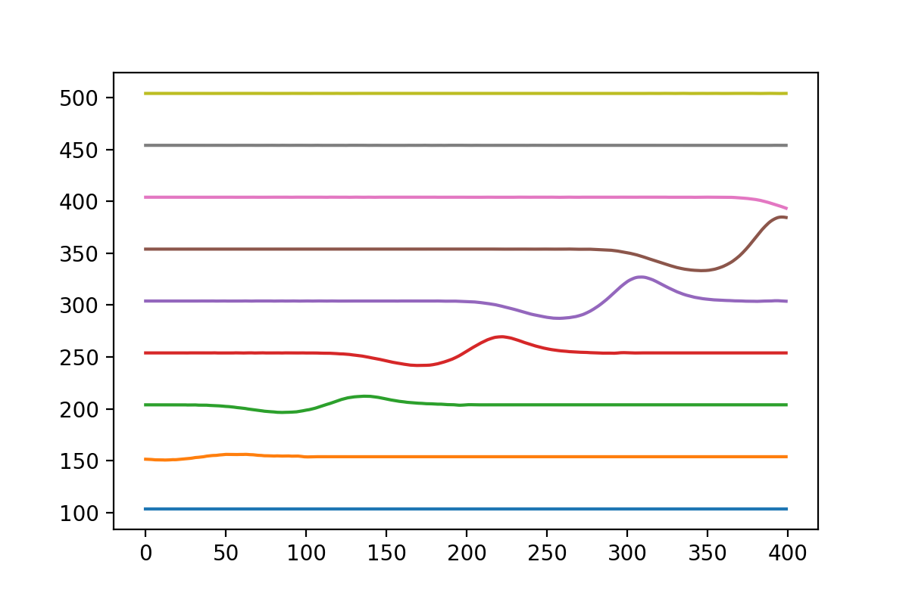

# 散射态的时域演化

[2021.1.3]

前面小节中，我们解释了一个局域波包的时域演化，但量子输运中，一般研究对象是散射态，即波函数在lead（连接散射区的导线）中是平面波，且延伸到无穷远。为了处理该问题（即如何将一个包含无穷远区域的物理问题，转化为有限区域的数学问题），这里就需要用到Source-Sink算法中的source部分（上一节中的吸收势即sink部分）。


**Ref:**

- [2.5. Solving one-body problems](https://kwant-project.org/extensions/tkwant/tutorial/onebody)

  本节目的是重复tkwant示例：2.5.2. Infinite systems 中第二个例子（Infinite systems with initial scattering states）

- *Linear-scaling source-sink algorithm for simulating time-resolved quantum transport and superconductivity*

  讲解如何使用Source-Sink算法求解含时输运问题，是tkwant的核心之一。论文第3页的左侧，这句话非常重要：The crucial point of Eq. (13) is that it only contains outgoing modes, as the incoming one has been subtracted when removing the stationary scattering state.

- *Numerical methods for time-resolved quantum nanoelectronics*

  博士论文，作者：Joseph WESTON，X. Waintal团队的学生（应该没错吧）。其附录部分：C.1 Gauge Transformations in Semi-Infinite Leads，推导如何在模型中加入电压的影响。

  


## 一、物理模型对应的数学问题

分解随时间变化的波函数：
$$
\Psi_E(t) = e^{-iEt} \ [\Psi_E^{\rm{st}}\ +\ \bar{\Psi}_E(t)]
\tag{Eq. 1}
$$
代入薛定谔方程：
$$
i\hbar \part_t\Psi_E = (H_0 + W_t)\Psi_E
\tag{Eq. 2}
$$
得到方程：
$$
i\part_t\bar{\Psi}_E = [H_0+W_t-E]\bar{\Psi}_E + W_t\Psi_E^{\rm{st}}
\tag{Eq. 3}
$$
**说明：**

- $\hbar=1$

- $H_0$ 为 $t=0$ 时，系统的哈密顿量（默认时间起点为0）；
- $W_t$ 位哈密顿量中随时间变化的部分，$W_t(t=0)=0$

- $\Psi_E^{\rm st}$ 为初态波函数（单体波函数），根据定态薛定谔方程求解：
  $$
  H_0 \Psi_E^{\rm{st}} = E\Psi_E^{\rm{st}}
  $$

- $\bar{\Psi}_E(t)$ 为波函数中，随时间变化的部分，$\bar{\Psi}_E(t=0)=0$；

- *Linear-scaling source-sink algorithm for simulating time-resolved quantum transport and superconductivity*

  这部分推导对应文献中 Eq.9 - Eq. 12。这里省略了指标 $\alpha$ 。

- 一开始，我以为上面的分解只是为了将相位因子$e^{-iEt}$ 抽出来，提高计算效率。后来，当我尝试计算时域演化时，才发现它是算法的核心之一。对于波函数$\Psi_E(t)$，可以认为有两个“源”，一个是散射区随时间变化的势场$W_t$；另一个是入射端的lead，不断往系统“注入”粒子。我们不能像第1、2节那样直接对含时薛定谔方程积分，因为1、2节中的初态波函数是局域的，在边界等于0，而这里的$\Psi_E(t)$ 延伸到无穷远，不能直接截断，而且边界处的吸收势也会对其造成额外影响。

  通过上面的分解，波函数中含时部分$\bar{\Psi}_E(t)$的演化方程Eq. 3，只包含1个源：$W_t$，而且满足$\bar\Psi_E(t=0)=0$，这样我们就得到一个可解的“局域”方程：

  step1：将该方程“放入”无限深势阱中，截断哈密顿量；

  step2：使用吸收势，去除边界处势垒的影响；

  step3：使用scipy的ODE库，对Eq. 3直接积分。


## 二、模型中加电压

我们在系统的一个lead上加电压，且满足下面两个条件：

1. 在该lead中，格点的电势相同，即整体同时变化（$=V(t)$）；
2. 电势降（电压）只发生在该lead与中心散射区连接部分。

那么我们可以通过规范变换引入电压，其影响是使连接处的hopping增加一个含时相位。详情见论文*Numerical methods for time-resolved quantum nanoelectronics* 的附录部分：C.1 Gauge Transformations in Semi-Infinite Leads。

**加电压前**

我们以一维系统为例，散射区左右两端各连接1个lead，系统哈密顿量如下：
$$
H = \begin{bmatrix} 
     H_{\rm lead_1}  &H_{c1}^\dagger         &0              \\
     H_{c1}     & H_s        &H_{c2} ^\dagger 		  \\
     0               &H_{c2} &H_{\rm lead_2} \\
    \end{bmatrix}
$$
其中：$H_s$为散射区哈密顿量，$H_{\rm lead}$为两个lead的哈密顿量，$H_c$连接lead和散射区，对与一维系统，它只有一个非0元：

$$
\newcommand\iddots{\mathinner{
    \kern1mu\raise1pt{.}
    \kern2mu\raise4pt{.}
    \kern2mu\raise7pt{\Rule{0pt}{7pt}{0pt}.}
    \kern1mu
  }}
  
  H_c = \begin{bmatrix} 
       \cdots  & 0 & -1 \\
               & 0 & 0 \\
       \iddots &   & \vdots \\
      \end{bmatrix}
$$

**加电压后**

在lead1上加电压 $V(t)$，哈密顿量的其他部分不变，只是在$H_{c1}$的非0元（hopping:  lead->center）上增加一个相位：
$$
\newcommand\iddots{\mathinner{
    \kern1mu\raise1pt{.}
    \kern2mu\raise4pt{.}
    \kern2mu\raise7pt{\Rule{0pt}{7pt}{0pt}.}
    \kern1mu
  }}
  H_{c1} = \begin{bmatrix} 
       \cdots  & 0 & -1\times e^{-i\phi(t)} \\
               & 0 & 0 \\
       \iddots &   & \vdots \\
      \end{bmatrix}
$$

其中：
$$
\phi(t) = \int^{t} \frac{eV(\tau)}{\hbar} d\tau
$$
注意，上面积分中，积分下限并不重要，可以为任意值，它只影响相位的常数部分，而起作用的只是相位的变化部分（其导数就是电压）。


## 三、示例程序

```python
import numpy as np
import matplotlib.pyplot as plt
import scipy
import scipy.sparse as sp
from scipy.sparse.linalg import spsolve
from scipy.integrate import solve_ivp
from scipy.special import erf
from tqdm import tqdm


#------------------------------------------------------------------------------------------------
class onebody_wf:   
    def __init__(self, momentum):
        self.momentum     = momentum
        self.energy       = 2*(1 - np.cos(momentum)) - 2  #色散关系
        self.speed        = 2*np.sin(abs(momentum))
        #散射区格点数
        self.num_center   = 400
        
        # 虚势的参数是根据tkwant得到的
        # boundaries from tkwant-example
        self.boundary_strength = 33.176446627131625
        self.boundary_degree   = 6
        self.boundary_buffer   = 101
        self.boundary_cells    = 88
        
        #total num_cell
        self.total_num_cell    = self.num_center + self.boundary_cells*2 +\
                                 self.boundary_buffer*2
        #中心散射区对应的格点位置
        self.pos_center_vec    = np.arange(self.boundary_cells + self.boundary_buffer, 
                    self.num_center + self.boundary_cells + self.boundary_buffer, 1)
        
    def init_operator(self):         
        # 对角元
        diag_vec    = np.zeros(self.total_num_cell, dtype=complex)
        #hopping
        offdiag_vec = - np.ones(self.total_num_cell - 1)
        
        #---------------------------------------
        #生成初始矩阵
        self.H0     = scipy.sparse.diags([diag_vec, offdiag_vec, offdiag_vec], [0, 1, -1])
        
        #---------------------------------------
        #生成带边界条件的初始矩阵
        #add boundaries from tkwant-example
        strength  = self.boundary_strength
        degree    = self.boundary_degree
        buffer    = self.boundary_buffer
        cells     = self.boundary_cells
        sigma_vec = -1j*(degree + 1) *strength * (np.arange(cells)/cells)**degree / cells
        sigma_vec = np.concatenate( (sigma_vec[::-1],
                                     np.zeros(buffer+self.num_center+buffer),
                                     sigma_vec) )
        self.H0_withBoundary = scipy.sparse.diags([diag_vec+sigma_vec, 
                                        offdiag_vec, offdiag_vec], [0, 1, -1])
        
        #初始的 Wt 矩阵
        center_site = self.pos_center_vec[0]
        lead_site   = center_site - 1
        self.Wt     = sp.csr_matrix( ([0.+0.j,0.+0.j], 
                        ([lead_site, center_site], [center_site, lead_site]) ), 
                        shape=(self.total_num_cell, self.total_num_cell) )
    
    def scatteringState(self):   
        #构建定态散射方程
        matrix_eq = self.H0 - self.energy * sp.eye(self.total_num_cell)
        matrix_eq = sp.csr_matrix(matrix_eq)
        #定态散射边界条件
        #left
        matrix_eq[0,0]   = 1
        matrix_eq[0,1]   = -np.exp(1j*abs(self.momentum))
        #right
        matrix_eq[-1,-1] = 1
        matrix_eq[-1,-2] = -np.exp(1j*abs(self.momentum))
        #入射态
        right_vec        = np.zeros(self.total_num_cell, dtype=complex)
        if self.momentum>0:            
            right_vec[0] = 1/np.sqrt(self.speed)*(1-np.exp( 2j*self.momentum)) 
        else:
            right_vec[-1]= 1/np.sqrt(self.speed)*(1-np.exp(-2j*self.momentum)) 
        #求解线性方程组，得到散射初态
        self.psi_init     = spsolve(matrix_eq, right_vec)  
        
    def evolve(self, t_vec): 
        # Phase from the time integrated voltage V(t).
        def phi(time):
            return 1.57 * (1 + erf((time - 40) / 20))
        
        def dfdt_func(t, psi_bar_vec):
            #电压相位对应的hopping位置
            center_site = self.pos_center_vec[0]
            lead_site   = center_site - 1 
            phase                           = phi(t)
            self.Wt[lead_site, center_site] = -1*(np.exp( 1j*phase) - 1)  #center -> lead
            self.Wt[center_site, lead_site] = -1*(np.exp(-1j*phase) - 1)  #lead -> center
            return  -1j*( ((self.H0_withBoundary + self.Wt - self.energy * sp.eye(self.total_num_cell)))@psi_bar_vec +
                         self.Wt@self.psi_init )      
        
        # %% Solve differential equation
        #计算psi_bar
        sol = solve_ivp(dfdt_func, [t_vec[0], t_vec[-1]], np.zeros(self.total_num_cell,dtype=complex), 
                        t_eval=t_vec, rtol=1e-5,atol=1e-8) 
        #由psi_bar得到psi
        self.psi = np.zeros( (self.total_num_cell, t_vec.size), dtype=complex)
        for n_t in range(t_vec.size):
            time            = t_vec[n_t]
            self.psi[:,n_t] = (sol['y'][:,n_t] + self.psi_init) * np.exp(-1j*self.energy*(time-0))
            
#------------------------------------------------------------------------------------------------   
t_vec    = np.arange(0, 401, 50)
energy   = -1
momentum = np.arccos(1-(energy+2)/2)

#实例化
wf_withMomentum = onebody_wf(momentum)
#初始化H0, H0_withBoundary, Wt
wf_withMomentum.init_operator()
#初态单体波函数
wf_withMomentum.scatteringState()
#时间演化
wf_withMomentum.evolve(t_vec)

%matplotlib inline
# Loop over the timesteps and plot the result.
for n_t in range(t_vec.size):
    psi_vec = wf_withMomentum.psi[:,n_t]
    density_vec = np.abs(psi_vec)**2
    # Prefactor and shift for representation purpose.
    pos_center_vec = wf_withMomentum.pos_center_vec
    plt.plot(180 * density_vec[pos_center_vec] + t_vec[n_t])
```

**计算结果：**

