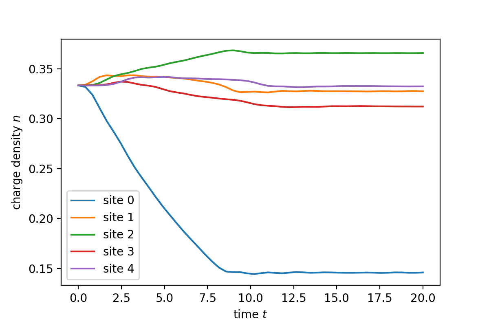

# 多体态的演化

[2021.1.20]

本节主要介绍如何计算多体态的时域演化，以及计算系统的客观测量。


**Ref:**

-  [2.2. Getting started: a simple example with a one-dimensional chain](https://kwant-project.org/extensions/tkwant/tutorial/getting_started)

  本节目的：重复tkwant示例 2.2. Getting started: a simple example with a one-dimensional chain

- *Linear-scaling source-sink algorithm for simulating time-resolved quantum transport and superconductivity*

  文中的（5）式。需要注意的是，论文中是对能量进行积分，但程序中，一般对动量积分更方便。

- [KRONROD Gauss-Kronrod Quadrature Rules](https://people.sc.fsu.edu/~jburkardt/py_src/kronrod/kronrod.html_)

  Gauss-Kronrod Quadrature Rules，并提供相关python库函数。

- https://keisan.casio.com/exec/system/1289382036

  Gauss-Kronrod quadrature讲解，并可以在线计算积分系数

  

  

## 一、物理模型对应的数学问题

根据*Linear-scaling source-sink algorithm for simulating time-resolved quantum transport and superconductivity* 中的（5）式，系统可观测量的计算：
$$
\lang \hat{A}(t) \rang = \sum_\alpha \int\frac{dE}{2\pi} f_\alpha(E) \Psi^\dagger_{\alpha E}(t) A \Psi_{\alpha E}(t)
$$
一维系统中，始终只有一个通道（channel），所以上面 $\alpha = L, R$ ，即从左右两个电子库入射的波函数。

在实际的计算中，我们使用动量作为态指标，所以上面的积分需要变换为对动量积分：
$$
\lang \hat{A}(t) \rang = \sum_\alpha \int dk \frac{V}{2\pi} f_\alpha(E) \Psi^\dagger_{\alpha k}(t) A \Psi_{\alpha k}(t)
$$
其中，$V=\frac{dE(k)}{\hbar dk}$表示速度。由于入射波函数的定义：$\Psi_{\alpha k}=\frac{1}{V}e^{ikx}$，其系数$1/V$源于能量空间的流归一化，所以转到动量空间后，需要乘以V（也可以从态密度的角度去理解）。

本例中，电子库温度为0，所以上式的积分区间$[0, k_F]$，其中$k_F$为费米能对应的波矢。数值求解积分时，需要积分变求和：$\int_a^b dx f(x)=\sum_n\Delta x \times f(x_n)$ ，一般我们是对自变量区间等间距取点。在tkwant中，使用的是Gauss-Kronrod Quadrature Rules：$\int_a^b dx f(x)=\sum_n \beta_n \times f(x_n)$，其中$\beta_n$为求和系数（tkwant中的math_weight参数），$x_n$为采样点，它们由Gauss-Kronrod方法决定，各有2N+1个，N为Gauss-Kronrod的阶数。

所以上述积分变为：
$$
\lang \hat{A}(t) \rang = 
\sum_{\alpha=L,R } \sum_n
\beta_n \gamma_n \Psi^\dagger_{\alpha k_n}(t) A \Psi_{\alpha k_n}(t)
$$
其中：

- $k_n$ 为积分区间内的采样点；
- $\beta_n$ 为tkwant中的 math_weight，即Gauss-Kronrod求和系数；
- $\gamma_n = \frac{V}{2\pi} f(E(k_n))$  为tkwant中的 phys_weight。

 **Note:**

- 没有仔细查看Gauss-Kronrod方法，所以并不能理解为什么它能提高计算精度。在下一节中，介绍tkwant用这个来估算误差，从这个角度可以认识它的用途。
- 计算Gauss-Kronrod系数的代码放在appendix中


## 二、示例程序

```python
import numpy as np
import matplotlib.pyplot as plt
import scipy
import scipy.sparse as sp
from scipy.sparse.linalg import spsolve
from scipy.integrate import solve_ivp

#------------------------------------------------------------------------------
# 一、对动量空间采样，用于积分
#[-1，1]区间内的kronrod method系数，结果是对称的
x = np.array([-0.99565716, -0.97390653, -0.93015749, -0.86506337, -0.78081773,
       -0.67940957, -0.56275713, -0.43339539, -0.29439286, -0.14887434,
        0.        ,  0.14887434,  0.29439286,  0.43339539,  0.56275713,
        0.67940957,  0.78081773,  0.86506337,  0.93015749,  0.97390653,
        0.99565716])
w = np.array([0.01169464, 0.03255816, 0.0547559 , 0.07503967, 0.09312545,
       0.10938716, 0.12349198, 0.13470922, 0.14277594, 0.1477391 ,
       0.14944555, 0.1477391 , 0.14277594, 0.13470922, 0.12349198,
       0.10938716, 0.09312545, 0.07503967, 0.0547559 , 0.03255816,
       0.01169464])

#energy_vec = 2*(1 - np.cos(momentum_vec)) - 1  #色散关系，向下平移了1个单位
chemical_potential = 0
kmin = 0
kmax = np.arccos(1-(chemical_potential+1)/2) 

# 将x映射到[0, kmax]
# 这里的posi表示k为正，即从左向右运动的粒子
momentum_posi_vec   = (x+1)/2*kmax
speed_posi_vec      = 2*np.sin(np.abs(momentum_posi_vec))
mathWeight_posi_vec = w    /2*kmax
physWeight_posi_vec = np.ones(w.size) /2/np.pi* speed_posi_vec
weight_posi_vec     = mathWeight_posi_vec * physWeight_posi_vec

#左行右行平面波简并
momentum_vec      = np.concatenate( (-momentum_posi_vec[::-1],momentum_posi_vec))
speed_vec         = np.concatenate( (speed_posi_vec[::-1], speed_posi_vec) )
weight_vec        = np.concatenate( (weight_posi_vec[::-1], weight_posi_vec) )

#------------------------------------------------------------------------------
#二、求解时域多体态
class onebody_wf:
    #simple boundery condition
    
    def __init__(self, momentum):
        self.momentum     = momentum
        self.energy       = 2*(1 - np.cos(momentum)) - 1
        self.speed        = 2*np.sin(abs(momentum))
        self.num_cell     = 100
        self.voltage_site = int(self.num_cell//2)      
        
    def hamitonian_timeDependent(self, time):
        def v_potential_func(time, tau=8):
            if time < tau:
                return time / tau
            return 1        
        #在hamitonian中加入电压的影响
        pos         = self.voltage_site
        diag_vec     = np.ones(self.num_cell, dtype=complex)
        diag_vec[pos]=diag_vec[pos] + v_potential_func(time)
        offdiag_vec  = - np.ones(self.num_cell - 1)        
        H            = scipy.sparse.diags([diag_vec, offdiag_vec, offdiag_vec], [0, 1, -1])

        return H

    def scatteringState(self):   
        #构建定态散射方程
        matrix_eq = self.hamitonian_timeDependent(0) - self.energy * sp.eye(self.num_cell)
        matrix_eq = sp.csr_matrix(matrix_eq)
        #边界条件
        #left
        matrix_eq[0,0]   = 1
        matrix_eq[0,1]   = -np.exp(-1j*abs(self.momentum))
        #right
        matrix_eq[-1,-1] = 1
        matrix_eq[-1,-2] = -np.exp(-1j*abs(self.momentum))
        #入射态
        right_vec        = np.zeros(self.num_cell, dtype=complex)
        if self.momentum>0:            
            right_vec[0] = 1/np.sqrt(self.speed)*(1-np.exp( 2j*self.momentum)) 
        else:
            right_vec[-1]= 1/np.sqrt(self.speed)*(1-np.exp(-2j*self.momentum)) 
        #求解线性方程组，得到散射初态
        self.psi_init     = spsolve(matrix_eq, right_vec)  
        
    def evolve(self, t_vec):  
        def dfdt_func(t, psi_bar_vec):
            H0 = self.hamitonian_timeDependent(0)
            H  = self.hamitonian_timeDependent(t)
            return  -1j*( ((H - self.energy * sp.eye(self.num_cell)) )@psi_bar_vec + (H - H0)@self.psi_init )
        
        # %% Solve differential equation
        #计算psi_bar
        sol = solve_ivp(dfdt_func, [t_vec[0], t_vec[-1]], np.zeros(self.num_cell,dtype=complex), t_eval=t_vec, rtol=1e-4,atol=1e-7) 
        #由psi_bar得到psi
        self.psi = np.zeros( (self.num_cell, t_vec.size), dtype=complex)
        for n_t in range(t_vec.size):
            time            = t_vec[n_t]
            self.psi[:,n_t] = (sol['y'][:,n_t] + self.psi_init) * np.exp(-1j*self.energy*(time-0))

#计算态的时域演化
t_vec           = np.linspace(0, 20)
manybody_wf_vec = []
for n_k in range(momentum_vec.size):
    #入射态的态指标
    k      = momentum_vec[n_k]
    #实例化
    wf_withMomentum = onebody_wf(k)
    #初态单体波函数
    wf_withMomentum.scatteringState()
    #时间演化
    wf_withMomentum.evolve(t_vec)
    #储存该态的演化数据
    manybody_wf_vec.append(wf_withMomentum)
    
#计算density   
density_vec = np.zeros( (5, t_vec.size) )
for n_t in range(t_vec.size):
    for n_k in range(momentum_vec.size):
        #提取波函数
        pos         = manybody_wf_vec[n_k].voltage_site
        psi_vec     = manybody_wf_vec[n_k].psi[:,n_t]
        
        #积分
        for n_site in range(5):
            density_vec[n_site, n_t] += (np.abs(psi_vec)**2)[pos+n_site]*weight_vec[n_k]
#绘图           
for n_site in range(5):
    plt.plot(t_vec, density_vec[n_site,:],label='site {}'.format(n_site))
    
plt.xlabel(r'time $t$')
plt.ylabel(r'charge density $n$')
plt.legend()
```

**计算结果：**




## Appendix

### 计算Gauss-Kronrod系数

1. 根据网站https://people.sc.fsu.edu/~jburkardt/py_src/kronrod/kronrod.html，找到python脚本：https://people.sc.fsu.edu/~jburkardt/py_src/kronrod/kronrod.py，复制内容，并保存为kronrod.py文件

2. 下面代码调用kronrod.py，计算Gauss-Kronrod系数：

   ```python
   #kronrod method计算区间[-1，1]内的系数，但由于结果是对称的，所以只给了一半的系数
   import kronrod as kronrod
   import numpy as np
   [x,w] = kronrod.kronrod(10,1e-16)[0:2]
   x = np.concatenate( (-x[:-1],x[::-1]))
   w = np.concatenate( (w[:-1],w[::-1]))
   ```

3. kronrod()函数的输入输入（kronrod.py中的说明文档）：

   ```
   #  Parameters:
   #
   #    Input, integer N, the order of the Gauss rule.
   #
   #    Input, real TOL, the requested absolute accuracy of the
   #    abscissas.
   #
   #    Output, real X(N+1), the abscissas.
   #
   #    Output, real W1(N+1), the weights for the Gauss-Kronrod rule.
   #
   #    Output, real W2(N+1), the weights for the Gauss rule.
   ```

