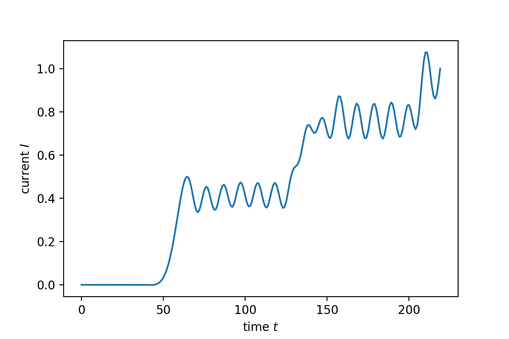

#  Fabry-Perot interferometer

[2021.1.21]

本节目的是重复出Fabry-Perot interferometer这个示例，以及介绍如何计算电流。

**Ref:**

- [2.3. Second example: Fabry-Perot interferometer](https://kwant-project.org/extensions/tkwant/tutorial/fabry_perot)

  

## 一、电流

电流的表达式：
$$
J = \frac{-i\hbar}{2m} \big[ \Psi^*\part_x\Psi - \Psi\part_x\Psi^*\big]
$$
一开始，我把电流理解为格点的性质，即某个格点对应的电流。那么，第n个格点电流的计算式：
$$
\begin{align}
J_n &= 
\frac{-i\hbar}{2m} 
\big[  
\Psi_n^*\frac{\Psi_{n+1} - \Psi_{n-1}}{2a}
-\Psi_n\frac{\Psi_{n+1}^* - \Psi_{n-1}^*}{2a}
\big]
\\
&= \frac{\hbar}{2ma} \mathrm{Im} [\Psi_n^*(\Psi_{n+1}-\Psi_{n-1})]
\end{align}
$$
用到程序中，发现会出现一些奇怪的现象。后看到tkwant中定义电流算符的代码，才反应过来，电流应该被理解为hopping的性质。

```python
# https://kwant-project.org/extensions/tkwant/tutorial/fabry_perot
# Define an operator to measure the current after the barrier.
hoppings = [(lat(78, 0), lat(77, 0))]
current_operator = kwant.operator.Current(syst, where=hoppings)
```

第n-1个格点到第n个格点的电流：
$$
\begin{align}
J_{n-1 \rightarrow n} &= 
\frac{-i\hbar}{2m} 
\big[  
\frac{\Psi_n^*+\Psi_{n-1}^*}{2} \frac{\Psi_{n} - \Psi_{n-1}}{a}
- \mathrm{h.c.}
\big]
\\
&= \frac{\hbar}{ma} \mathrm{Im} [\Psi_n \Psi_{n-1}^*]
\end{align}
$$


## 二、示例程序

**Note:** tkwant，初始化多体态时，默认使用10阶Gauss-Kronrod积分方法（即每个通道有21个动量值）。在本例中，该取值不能满足精度需求，所以通过下面这行代码来进一步细分积分区间：`state.refine_intervals(rtol=0.3, atol=0.3)` 。为了简化问题，我们直接保存`state.refine_intervals()`函数生成的采样点，即下面示例代码中的momentumAndWeight.npz。

```python
import numpy as np
import matplotlib.pyplot as plt
import scipy
import scipy.sparse as sp
from scipy.sparse.linalg import spsolve
from scipy.integrate import solve_ivp

class onebody_wf:   
    def __init__(self, momentum):
        self.momentum     = momentum
        self.energy       = 2*(1 - np.cos(momentum)) - 2  #色散关系
        self.speed        = 2*np.sin(abs(momentum))
        #散射区格点数
        self.num_center   = 81
        #add boundaries，数据来自tkwant
        self.boundary_strength = 45.3618607778088
        self.boundary_degree   = 6
        self.boundary_buffer   = 74
        self.boundary_cells    = 65
        #total num_cell
        self.total_num_cell    = self.num_center + self.boundary_cells*2 + self.boundary_buffer*2
        #中心散射区对应的格点位置
        self.pos_center_vec    = np.arange(self.boundary_cells + self.boundary_buffer, 
                                           self.num_center + self.boundary_cells + self.boundary_buffer, 1)
        
    def init_operator(self):       
        # Central scattering region.
        diag_vec       = np.zeros(self.num_center, dtype=complex)
        # Backgate potential.
        diag_vec[5:75] = -0.0956
        # Barrier potential.
        diag_vec[4]    = 5.19615
        diag_vec[75]   = 5.19615
        #加上界条件对应的格点
        diag_vec = np.concatenate( (np.zeros(self.boundary_cells + self.boundary_buffer, dtype=complex), 
                                   diag_vec,
                                   np.zeros(self.boundary_cells + self.boundary_buffer, dtype=complex) ) )
        #hopping
        offdiag_vec = - np.ones(self.total_num_cell - 1)
        
        #---------------------------------------
        #生成初始矩阵
        self.H0     = scipy.sparse.diags([diag_vec, offdiag_vec, offdiag_vec], [0, 1, -1])
        
        #---------------------------------------
        #生成带边界条件的初始矩阵
        #add boundaries from tkwant-example
        strength  = self.boundary_strength
        degree    = self.boundary_degree
        buffer    = self.boundary_buffer
        cells     = self.boundary_cells
        sigma_vec = -1j*(degree + 1) *strength * (np.arange(cells)/cells)**degree / cells
        sigma_vec = np.concatenate( (sigma_vec[::-1],
                                     np.zeros(buffer+self.num_center+buffer),
                                     sigma_vec) )
        self.H0_withBoundary = scipy.sparse.diags([diag_vec+sigma_vec, offdiag_vec, offdiag_vec], [0, 1, -1])
        
        #Wt
        center_site = self.pos_center_vec[0]
        lead_site   = center_site - 1
        self.Wt     = sp.csr_matrix( ([0.+0.j,0.+0.j], ([lead_site, center_site], [center_site, lead_site]) ), 
                          shape=(self.total_num_cell, self.total_num_cell) )
    
    def scatteringState(self):   
        #构建定态散射方程
        matrix_eq = self.H0 - self.energy * sp.eye(self.total_num_cell)
        matrix_eq = sp.csr_matrix(matrix_eq)
        #定态散射边界条件
        #left
        matrix_eq[0,0]   = 1
        matrix_eq[0,1]   = -np.exp(1j*abs(self.momentum))
        #right
        matrix_eq[-1,-1] = 1
        matrix_eq[-1,-2] = -np.exp(1j*abs(self.momentum))
        #入射态
        right_vec        = np.zeros(self.total_num_cell, dtype=complex)
        if self.momentum>0:            
            right_vec[0] = 1/np.sqrt(self.speed)*(1-np.exp( 2j*self.momentum)) 
        else:
            right_vec[-1]= 1/np.sqrt(self.speed)*(1-np.exp(-2j*self.momentum)) 
        #求解线性方程组，得到散射初态
        self.psi_init     = spsolve(matrix_eq, right_vec)  
        
    def evolve(self, t_vec): 
        # Phase from the time integrated voltage V(t).
        def phi(time):
            vb, tau = 0.6, 30.
            if time > tau:
                return vb * (time - tau / 2.)
            return vb / 2. * (time - tau / np.pi * np.sin(np.pi * time / tau))    
        
        def dfdt_func(t, psi_bar_vec):
            phase                           = phi(t)
            self.Wt[lead_site, center_site] = -1*(np.exp( 1j*phase) - 1)  #center -> lead
            self.Wt[center_site, lead_site] = -1*(np.exp(-1j*phase) - 1)  #lead -> center
            return  -1j*( ((self.H0_withBoundary + self.Wt - self.energy * sp.eye(self.total_num_cell)) )@psi_bar_vec +
                         self.Wt@self.psi_init )
        
        #电压相位对应的hopping位置
        center_site = self.pos_center_vec[0]
        lead_site   = center_site - 1        
        
        # %% Solve differential equation
        #计算psi_bar
        sol = solve_ivp(dfdt_func, [t_vec[0], t_vec[-1]], np.zeros(self.total_num_cell,dtype=complex), t_eval=t_vec, rtol=1e-6,atol=1e-9) 
        #由psi_bar得到psi
        self.psi = np.zeros( (self.total_num_cell, t_vec.size), dtype=complex)
        for n_t in range(t_vec.size):
            time            = t_vec[n_t]
            self.psi[:,n_t] = (sol['y'][:,n_t] + self.psi_init) * np.exp(-1j*self.energy*(time-0))


#动量空间采样，数据来自tkwant
data = np.load('momentumAndWeight.npz')
momentum_vec = data['momentum_vec']
weight_vec   = data['weight_vec'][:,-1]
            
#计算时域演化
t_vec = np.arange(220)
manybody_wf_vec = []

for n_k in range(momentum_vec.size):
    #入射态的态指标
    k      = momentum_vec[n_k]
    #实例化
    wf_withMomentum = onebody_wf(k)
    #初始化H0, H0_withBoundary, Wt
    wf_withMomentum.init_operator()
    #初态单体波函数
    wf_withMomentum.scatteringState()
    #时间演化
    wf_withMomentum.evolve(t_vec)
    #储存该态的演化数据
    manybody_wf_vec.append(wf_withMomentum)

#计算电流
current_vec = np.zeros( t_vec.size )
for n_t in range(t_vec.size):
    for n_k in range(momentum_vec.size):
        #提取波函数
        pos_curr = manybody_wf_vec[n_k].pos_center_vec[77]  
        psi_vec = manybody_wf_vec[n_k].psi[:,n_t]
        current = 2*np.imag( psi_vec[pos_curr].conj()*(psi_vec[pos_curr+1]) )    
        #积分
        current_vec[n_t] += current*weight_vec[n_k]
        
# Plot the normalized current vs. time.
plt.plot(t_vec, current_vec / current_vec[-1])
plt.xlabel(r'time $t$')
plt.ylabel(r'current $I$')
```

**计算结果：**

