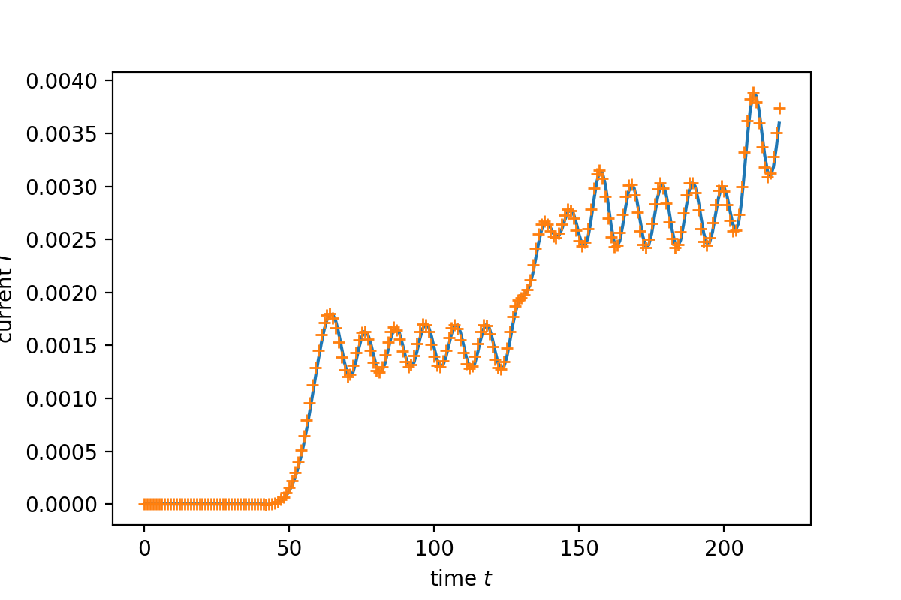

# Tkwant使用总结

[2021.1.21]

Tkwant的示例演示了如何用少量的代码就能一些计算复杂问题。大量的计算过程都被封装了起来，程序看着非常简洁，但却增加了使用者的理解难度。一开始接触tkwant，最令我头疼的是，不知道怎样或者计算过程的关键量，比如哈密顿量、波函数、动量如何取值等等。示例中只有构建系统和展示结果。

本节主要介绍如何获取计算过程的中间量以及一些基础理解（基于示例Fabry-Perot interferometer）。建议用jupyter notebook直接查看**7_tkwants使用总结.ipynb**。

```python
from math import sin, pi
import matplotlib.pyplot as plt
import tkwant
import kwant
import numpy as np
```


```python
def make_fabry_perot_system():

    # Define an empty tight-binding system on a square lattice.
    lat = kwant.lattice.square(norbs=1)
    syst = kwant.Builder()

    # Central scattering region.
    syst[(lat(x, 0) for x in range(80))] = 0  #能带整体向下移动2个能量单位
    syst[lat.neighbors()] = -1
    # Backgate potential.
    syst[(lat(x, 0) for x in range(5, 75))] = -0.0956
    # Barrier potential.
    syst[[lat(4, 0), lat(75, 0)]] = 5.19615

    # Attach lead on the left- and on the right-hand side.
    sym = kwant.TranslationalSymmetry((-1, 0))
    lead = kwant.Builder(sym)
    lead[(lat(0, 0))] = 0
    lead[lat.neighbors()] = -1
    syst.attach_lead(lead)
    syst.attach_lead(lead.reversed())

    return syst, lat


# Phase from the time integrated voltage V(t).
def phi(time):
    vb, tau = 0.6, 30.
    if time > tau:
        return vb * (time - tau / 2.)
    return vb / 2. * (time - tau / pi * sin(pi * time / tau))
```

## 一、通过kwant创建系统


```python
# Make the system and add voltage V(t) to the left lead (index 0).
syst, lat = make_fabry_perot_system()
tkwant.leads.add_voltage(syst, 0, phi)
syst = syst.finalized()
```

**Note:**
 - finalized()函数

    finalized()是一个函数，输出值才是设置好的syst，即finiteSystem。单纯地syst.finalized()，syst依然是Builder，而不是 finiteSystem

    `syst.finalized()`  #<kwant.builder.Builder object at 0x7f718f904610>
    
    `syst=syst.finalized()`  #<FiniteSystem with 400 sites, and 798 hoppings>

 - kwant.plot()函数

   `kwant.plot(syst);plt.close()`
   
   后面跟一个plt.close()是为了防止jupyter再输出一个图。否则会有两个图。

## 二、tkwant初始化多体系统


```python
# Define an operator to measure the current after the barrier.
hoppings = [(lat(78, 0), lat(77, 0))]
current_operator = kwant.operator.Current(syst, where=hoppings)

# Set occupation T = 0 and mu = -1 for both leads.
occup = tkwant.manybody.lead_occupation(chemical_potential=-1)
```


```python
# Initialize the time-dependent manybody state. Use a lower
# accuracy for adaptive refinement to speed up the calculation.
times = range(220)
state = tkwant.manybody.State(syst, tmax=max(times), 
                              occupations=occup,
                              refine=False, combine=True)
```

### 2.1 查看Boundaries

 - 边界势参数的选择是一个优化过程。

 - 如何使用这些参数，可以查看源代码，lead.py -> class MonomialAbsorbingBoundary()  

   文件位置：anaconda3/envs/env-tkwant/lib/python3.7/site-packages/tkwant
   
   关键代码：
   ```python
   def _absorb(self, cell):
       n = self.degree
       return (n + 1) * self.strength * (cell**n / self.num_cells**(n + 1))
   ```

```python
boundaries = state.boundaries
print(len(boundaries))

#ouput:
#    2
```


第1个lead中的虚势参数


```python
print('strength: ', boundaries[0].strength)
print('degree: ', boundaries[0].degree)
print('buffer: ', boundaries[0].num_buffer_cells)
print('imaginary: ', boundaries[0].num_cells )

#ouput:
#    strength:  45.3618607778088
#    degree:  6
#    buffer:  74
#    imaginary:  65
```

第2个lead中的虚势参数


```python
print('strength: ', boundaries[1].strength)
print('degree: ', boundaries[1].degree)
print('buffer: ', boundaries[1].num_buffer_cells)
print('imaginary: ', boundaries[1].num_cells )

#output
#    strength:  45.3618607778088
#    degree:  6
#    buffer:  74
#    imaginary:  65
```


### 2.2 查看tasks

 - tasks记录了整个系统中，单体波函数相关的参数

 - 关于tasks，可以查看源代码，onebody.py中的class Task()，文件位置：
   anaconda3/envs/env-tkwant/lib/python3.7/site-packages/tkwant/onebody/onebody.py
   
 - 关于phys_weights，可以查看源代码，manybody.py中的_calc_modes_and_weights()函数。文件位置：
   anaconda3/envs/env-tkwant/lib/python3.7/site-packages/tkwant

    ```python
   phys_weights = jacobian * distribution(energies) / (2 * np.pi)
   #经过检查，本例中温度为0，distribution(energies)的输出全为1
   #momentum积分: jacobian = velocities
   #energy积分: jacobian = 1
    ```


```python
print(type(state.manybody_wavefunction.tasks))

#output
#    <class 'dict'>
```

```python
print(state.manybody_wavefunction.tasks.keys())
#一维系统有两个lead，入射方向相反的平面波，且使用流归一化。
#初始化时，默认采用10阶Gauss-Kronrod对积分区间进行离散化，
#momentum空间取样点数为2*order+1=21，两个方向简并，所以一共有42个单体波函数

#output:
#    dict_keys([0, 1, 2, 3, 4, 5, 6, 7, 8, 9, 10, 11, 12, 13, 14, 15, 16, 17, 18, 19, 20, 21, 22, 23, 24, 25, 26, 27, 28, 29, 30, 31, 32, 33, 34, 35, 36, 37, 38, 39, 40, 41])
```

```python
#以tasks中第一个为例
task = state.manybody_wavefunction.tasks[0]

print('lead: ',        task.lead) #在本例中，lead=0或1，表示左右两个lead
print('mode: ',        task.mode) #一维系统中mode全部为0，在二三维系统中才有意义
#该单体态的动量值，以进入散射区的方向为正，所以动量值均为正。注意其单位为1/a，a为晶格常数
#动量区间是[0,kF]，然后通过kronrod方法进行离散化
print('momentum:',     '%0.5f'%task.momentum) 
print('phys_weight: ', '%0.5f'%task.phys_weight)#等于 V/2/pi*fermi_distribution
print('math_weight: ', task.math_weight) #第一个为Gauss积分系数，第二个为kronrod积分系数，默认使用第2个
print('weight: ',      task.weight) #数值积分时的权重，等于math_weight*phys_weight，默认使用第二个系数，即kronrod积分

#output:
#    lead:  0
#    mode:  0
#    momentum: 0.00227
#    phys_weight:  0.00072
#    math_weight:  [0.        0.0061233]
#    weight:  [0.00000000e+00 4.43209212e-06]
```


## 三、refine intervals


```python
[errsum_max, intervals, errors] =state.refine_intervals(rtol=0.3, atol=0.3)
```


 - 目的：tkwant通过该函数细分积分区间，以满足精度要求

 - 默认情况下，用于估算积分误差的可观测量是散射区格点的粒子密度；
   在 class state 初始化函数中，有如下代码：
   ```python
    if error_op is None:
        error_op = kwant.operator.Density(syst)
    else:
   ```

 - 估算积分误差的函数：manybody.py - > _error_estimate_quadpack()

   该函数的代码并不多，而且注释中提供了详细的解释以及参考文献（没仔细看）
   
   [1] Piessens, R., de Doncker-Kapenga, E., Ueberhuber, C. W., and Kahaner, D. K., QUADPACK A Subroutine Package for Automatic Integration, Springer-Verlag, Berlin, (1983).

   [2] Gonnet, P., A Review of Error Estimation in Adaptive Quadrature, ACM Computing Surveys, Vol. 44, No. 4, Article 22, (2012).


 - 估算误差的数学表达式：

$$
  \varepsilon = \tilde{I} \text{min} \bigl\{1, (200
        \frac{G_n[a, b] - K_{2n + 1}[a, b]}{\tilde{I}})^{3/2} \bigr\}
$$

  其中：

$$
  \tilde{I} = \int_a^b |f(x) - \frac{K_{2n + 1}[a, b]}{b - a} |dx
$$

  $G_n[a, b]$为n阶Gauss积分的结果，$K_{2n+1}[a,b]$为n阶Kronrod积分的结果，$[a,b]$为积分区间

 - 大致流程：

   1. 初始interval为[0,kF]的大区间；
   
   2. 用10阶Gauss-Kronrod方法对该区间进行积分，并估算误差；
   
   3. 判断每个格点的密度的误差是否满足条件，如果是，则完成区间细分；
   
   4. 如果否，则找出误差最大的区间，并将其对半分为两个小区间；
   
   5. 重复上述操作，直到$[0,k_F]$的积分误差满足要求。

 - 如何查看refine_intervals()的执行过程：在manybod.py->refine_intervals()函数中的while循环中，插入下面代码，即可输出区间的细分过程（大约在manybody.py文件的第1826行）
     ```python
     while True:
         for interval in intervals:
             print(interval)
         print()
     ```

 - rtol, atol：相对误差和绝对误差

   在refine_intervals()函数中，下面这行计算误差需要满足的条件
   
   errbnd = np.maximum(atol, rtol * np.abs(result))

### 3.1查看interval

refine_intervals()函数执行后，[0,kF]的大区间被划分为7个小区间，每个区间有 2*10+1=21 个momentum值，对于每一个lead，有7*21=147个单体波函数。系统有两个lead（编号为0，1），所以总共有294个单体波函数。


```python
for interval in intervals:
    print(interval)
    
#output:
#quadrature interval: lead=(0, 1), band=0, kmin=0.523599, kmax=0.785398, order=10, quadrature=kronrod, integration_variable=momentum
#quadrature interval: lead=(0, 1), band=0, kmin=0.785398, kmax=0.916298, order=10, quadrature=kronrod, integration_variable=momentum
#quadrature interval: lead=(0, 1), band=0, kmin=0.981748, kmax=1.047198, order=10, quadrature=kronrod, integration_variable=momentum
#quadrature interval: lead=(0, 1), band=0, kmin=0.916298, kmax=0.981748, order=10, quadrature=kronrod, integration_variable=momentum
#quadrature interval: lead=(0, 1), band=0, kmin=0.261799, kmax=0.523599, order=10, quadrature=kronrod, integration_variable=momentum
#quadrature interval: lead=(0, 1), band=0, kmin=0.130900, kmax=0.261799, order=10, quadrature=kronrod, integration_variable=momentum
#quadrature interval: lead=(0, 1), band=0, kmin=-0.000000, kmax=0.130900, order=10, quadrature=kronrod, integration_variable=momentum
```


## 四、时域演化（并提取波函数）


```python
# Loop over timesteps and evaluate the current.
currents_my = []
currents    = []
for time in times:
    state.evolve(time)    
    current = state.evaluate(current_operator)
    currents.append(current)
    
    #我的电流计算
    current  = 0
    pos_curr = 77
    for key_wf in state.manybody_wavefunction.psi.local_data().keys():
        #psi_st = state.manybody_wavefunction.psi.local_data()[key_wf].psi_st #散射初态
        psi_vec = state.manybody_wavefunction.psi.local_data()[key_wf].psi()
        weight  = (state.manybody_wavefunction.tasks[key_wf].weight)[-1]
        current+= weight *  2*np.imag( psi_vec[pos_curr].conj()*(psi_vec[pos_curr+1]) )
    currents_my.append(current)
```


```python
# Plot the normalized current vs. time.
plt.plot(times, currents)
plt.plot(times, currents_my, '+')
plt.xlabel(r'time $t$')
plt.ylabel(r'current $I$')
plt.show()
```

**计算结果：**



# Appendix 

保存momentum&weight数据


```python
momentum_vec = []
weight_vec   = []

tasks = state.manybody_wavefunction.tasks
for n_task in tasks.keys():
    if (tasks[n_task].lead == 0):
        #lead==0, 从左边电子库入射的电子，在我的演示代码中，以从左向右为正方向
        momentum_vec.append( tasks[n_task].momentum  )
    if (tasks[n_task].lead == 1):
        #lead==1, 从右边电子库入射的电子，保存时，加上负号
        momentum_vec.append( -tasks[n_task].momentum  )
    weight_vec.append( tasks[n_task].weight  )   
np.savez('momentumAndWeight.npz', weight_vec=weight_vec, momentum_vec=momentum_vec)
```
