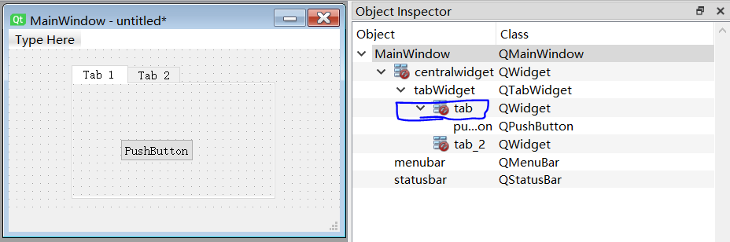
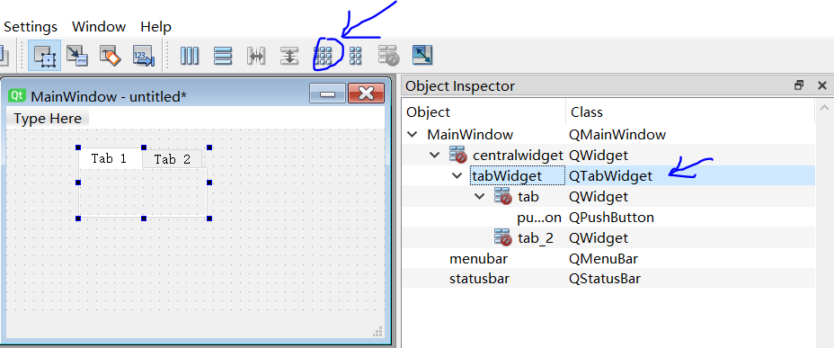
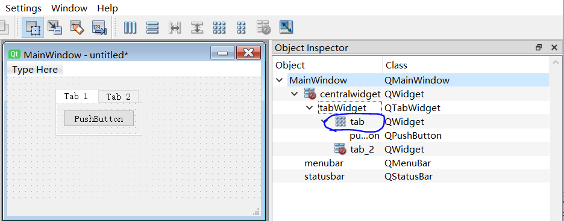
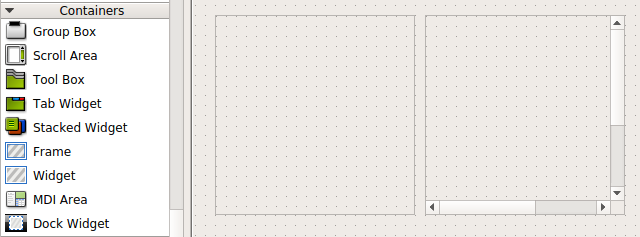

# 使用python编写自动测量程序（带图形界面）


## 0. 写在前面

**说明：** 

- 该总结是为了说明如何编写一个带图形界面的软件，完成自动化测量过程，方便控制仪器或者采集数据。但对于一些复杂的实验过程，或者临时设计的实验方案，更推荐直接使用Jupyter Notebook来编写并执行python程序。在使用Jupyter Notebook时，只要终端没有断开，数据始终保存在电脑内存中，可以随时调用，所以使用起来非常灵活。仪器控制、数据获取、数据处理、绘图等，可以在同一个脚本中完成，非常方便。
- 如果不需要图形界面，则可以直接学习PyVisa


### 0.1 辛酸历程（写该总结的目的）

一开始，我很犹豫是否要重写实验室的测量软件，毕竟那是我还不会python编程（平时主要使用octave进行数值计算），对图形化编程更是一无所知。抱着试一试的态度，利用空余时间，学习python，以及tkinter（Python GUI编程），进度非常缓慢。后来遇到pyqt以及qt-designer，这才让我下定决心，投入精力重写测量程序。

整个过程收获很大，但由于网上几乎没有针对性的教程（也可能是没找到），走了很多弯路，浪费了很多时间。例如，相比pyqt+qt-designer组合，使用tkinter会花费更多的时间在界面搭建上；执行测量过程没有使用多线程，导致界面卡死；使用注重质量而非速度的matplotlib库进行实时绘图，cpu资源占用过多导致界面卡死（更好的选择是pyqtgraph，而且pyqtgraph与pyqt结合更容易）；等等等等等等等。。。

所以，我总结了该过程的一些经验，希望有所帮助。


### 0.2 为什么不使用Labview？

对于专业的labview工程师来说，下面的一些问题可能不成立。不过对于大部分学生来说，没有足够的时间去达到非常专业的程度，都是一边学，一边尝试解决问题。所以下面的体验应该同样适用其他同学。

- 处理复杂问题时，labview程序很容易变得难以阅读，难以维护
- 不能方便地复制粘贴代码
- python的代码更简洁，更好阅读
- 在网上交流时，labview代码一般是以图片的形式呈现，很局限，无法展示复杂代码
- python编程中遇到问题，很容易在网上找到答案，而如果使用labview遇到问题，额。。。
- 相比python（或者其他语言），labview更像是一个复杂软件，需要很多类似于 右击->属性->修改something 的操作。有时，即使得到源代码，如果没有文字叙述来指明，这部分信息也很容易被遗漏
- 正版labview很贵！
- 使用pyqt+qt-designer，带图形界面的编程变得非常简单
- 对于初学者，python友好得多
- python功能强大，还可以进行数值运算，论文绘图等
- 。。。


### 0.3 需要的材料（or关键点/排坑）

- **python3**：

- **pyqt5** ：PyQt is one of the most popular Python bindings for the Qt cross-platform C++ framework.（来自Python WiKi）。

  （排坑经验：一开始我使用tkinter来构建图形界面，嗯···，很麻烦。后面找到了pyqt + qt-designer的组合，啊，搭建图形界面变得如此简单，终于可以吊打labview了（开个玩笑））

- **QThread（多线程）**：我们的测量程序需要两个线程。主线程用于主界面（图形化界面，测量前设置实验仪器，参数设置，测量中实时绘图、展示数据等）。第二线程用于执行测量过程，在开始测量时，启动该线程，然后扫面参数空间，读取仪器测量结果并向主线程返回测量值。测量结束后，关闭该线程。

  （排坑经验：一开始使用单线程，执行测量时，界面会卡死，没有任何反应。等到测量结束后，界面才有反应。所以如果需要在测量的同时，实时展示数据（或者图形界面响应用户操作），就需要新开一个线程单独执行测量过程，并使用pyqtSignal向主进程发送信号&传送数据。）

- **qt-designer**：Qt Designer is a tool for quickly building graphical user interfaces with widgets from the Qt GUI framework. It gives you a simple drag-and-drop interface for laying out components such as buttons, text fields, combo boxes and more.（来自官网的介绍）
  
  
  
- **pyqtgraph**：Scientific Graphics and GUI Library for Python. 用于绘图，实时显示测量数据。pyqtgraph绘图速度很快，而且它的图形界面本身就是使用pyqt库，所以可以很方便地在qt-designer中放置pyqtgraph控件。matplotlib虽然更为大家熟知，但它侧重于绘图质量，而非速度。在pyqtgraph官网首页的末尾，有不同绘图库的对比，大家可以根据自己需求选择相应的工具。官网：www.pyqtgraph.org/

  （排坑经验：一开始我也是使用matplotlib用于实时绘图，发现计算机变得特卡，它需要占用大量资源。后来发现了pyqtgraph，不仅使用方便，而且效率特高！）
  
- **PyVISA（python库函数）**：A Python package for support of the “Virtual Instrument Software Architecture” (VISA), in order to control measurement devices and test equipment via GPIB, RS232, Ethernet or USB （来自pypi）.  用于与实验仪器通讯。

  可能还需要安装PyVISA-py库函数（A PyVISA backend that implements a large part of the “Virtual Instrument Software Architecture” ([VISA](http://www.ivifoundation.org/Downloads/Specifications.htm)) in pure Python (with the help of some nice cross platform libraries python packages!) （来自pypi））.

- **git**：代码管理

- **nidaqmx（python库函数, optional）**：Contains a Python API for interacting with NI-DAQmx (来自pypi). 如果实验中使用到NI公司的硬件，可能需要该库函数，用来在python中设置/读取这些硬件（配合NI公司的NIDAQmx软件使用，这个软件是公开免费的，可以在官网直接下载）。

**需要安装的Python库函数：**

```python
pip install numpy
pip install pyqt5      #程序使用pyqt5搭建图形化界面
pip install PyVISA 
pip install PyVISA-py
pip install pyqtgraph
pip install nidaqmx    #optional, Contains a Python API for interacting with NI-DAQmx 
```


## 1. python3

如果你已经学过其他编程语言，那么在网上随便找一个简洁的教程，多敲示例代码，对python有一个基础了解后，就可以马上动手编写测量软件。在实际使用中，遇到问题再上网查找，逐渐熟悉python编程。而且，完全不必担心自己程序设计不合理，在后期难以修改。对于实验室测量来说，程序不会太大，即使是大的改动，也不会耽搁太多时间。

如果你没有编程经验，那么最好还是认真学习一下，网上找一个评价高的教材，注意，不仅要学习语法，更重要的是了解如何通过编程来解决实际问题（毕竟计算机的工作方式跟人的大脑还是有很大区别的）。对于理工科学生来说，投入精力学习编程是非常值得的。

如何选择编辑器：对于初学者来说，最好选择功能简单的编辑器（or IDLE），避免把精力浪费在折腾工具上面。在ubuntu中，我使用gedit（ubuntu默认的文本编辑器）。在windows中，我推荐使用python自己提供的编辑器，或者Thonny（面向初学者的python编辑器，非常简洁易用）。

（记得以前本科，自己还是电脑小白时，两次学编程的惨痛经历，一次c语言，一次Fortran，由于编辑器的原因，连最简单的示例程序都执行不成功，很快就没了热情。所以对于初学者，最好使用最简单、最基础的工具，把精力放在程序学习上，并在重复示例代码中，获得满足感。）


## 2. pyqt5

**学习资料**：https://pythonprogramming.net/basic-gui-pyqt-tutorial/。这是一个非常好的pyqt入门课程，老师也很逗。学完这个课程后，就可以动手编写自己的程序了，在使用中遇到任何细节问题，再google。下面是总结我在使用中遇到的一些问题（可以跳过）。

- 程序中使用到的，pyqt控件的一些操作

  ```python
  #menubar:
  action.triggered.connect(someMethod)
  menubar.setDisabled(True)
  
  #frame:
  frame.setDisabled(True)
  
  #checkBox:
  checkBox.setChecked( True_or_False )
  checkBox.stateChanged.connect(someMethod)
  checkBox.isChecked()  #get the state of checkBox, output: True/False
  
  #comboBox:
  index = comboBox.findText("string")
  comboBox.setCurrentIndex(index)
  comboBox.currentTextChanged.connect(someMethod)
  comboBox.setDisabled( True_or_False )
  
  #lineEdit:
  lineEdit.setText("0.1")
  lineEdit.text()          #get text of lineEdit
  lineEdit.setDisabled( True_or_False )
  lineEdit.editingFinished.connect(someMethod)
  lineEdit.setCursorPosition(0) #从输入内容的开头显示
  
  #textEdit:
  textEdit.setText("string")
  textEdit.toPlainText()    #get text of textEdit
  
  #pushButton:
  pushButton.setStyleSheet("background-color: rgb(255,0,0)")
  pushButton.clicked.connect(someMethod)
  pushButton.setText("OK")
  pushButton.text()  #get the text of pushButton
  
  #getExistingDirectory:
  folderPath = QFileDialog.getExistingDirectory(QtWidgets.QWidget(), 
                                                "Select Folder",
                                                "./")
        
  #dialog:
  #forbidden main window
  dialog.setWindowModality(QtCore.Qt.ApplicationModal)
  dialog.show()
  
  #QMessageBox:
    msg = QMessageBox()
    msg.setIcon(QMessageBox.Warning)
    msg.setText("Wrong Input!")
    msg.setWindowTitle("Warning!")
    msg.exec_()
  
  #setStyle:
  style_str = "fusion"
  QtGui.QApplication.setStyle(QtGui.QStyleFactory.create(style_str))
  
  #mainWindow size:
  width    = frameGeometry().width()
  height   = frameGeometry().height()
  geometry = QtCore.QRect(10, 10, width, height)
  widget.setGeometry(geometry)
  
  #tab
  tab.setCurrentIndex(index) #index is an integer
  tab.setTabEnabled(index, False_or_True)
  ```

- **connect**() : 

  **Note**：如果connect()中放置的函数有输入参数，则需要使用lambda来定义该函数

  ```python
  import sys
  from PyQt5 import QtWidgets
  
  class MyWindow(QtWidgets.QWidget):
    def __init__(self):
      super(MyWindow,self).__init__()
      #---- 1. connect 无参数函数----
      self.myButton = QtWidgets.QPushButton(self)  #创建按钮
      self.myButton.setText("Button 1")         #设置按钮text
      self.myButton.clicked.connect(self.func1)
      #---- 2. connect 常数参数函数 ----
      self.myButton2 = QtWidgets.QPushButton(self)  #创建按钮
      self.myButton2.setText("Button 2")         #设置按钮text
      self.myButton2.move(0,40)
      string2 = "Button 2"
      self.myButton2.clicked.connect(lambda:self.func2(string2))
      #---- 3. connect 含变量函数 ----
      self.myButton3 = QtWidgets.QPushButton(self)  #创建按钮
      self.myButton3.setText("Button 3")         #设置按钮text
      self.myButton3.move(0,80)
      string3 = "Button 3"
      self.myButton3.clicked.connect(lambda state, x=string3 : self.func3(x))
      #注意这里的state是pushButton.clicked.connect的默认参数，但我们并不需要。
      #所以在lambda函数中，第一个参数放置state，而函数self.func3(x)没有对应的自变量，
      #这样就可以忽略该参数
      #如果不忽略该默认参数，即：connect(lambda x=string3 : self.func3(x))
      #终端打印出来的是：False，而非Button 3
  
    def func1(self):
      print("Func1: ", "Button 1")
  
    def func2(self, x):
      print("Func2: ", x)
      
    def func3(self, x):
      print("Func3: ", x)
  
  if __name__=="__main__":  
    app=QtWidgets.QApplication(sys.argv) 
    myshow=MyWindow()
    myshow.show()
    sys.exit(app.exec_())
  ```

- **QFileDialog**：弹出文件夹（or路径）选择窗口

  ```python
  from PyQt5 import QtWidgets
  from PyQt5.QtWidgets import QFileDialog
  import sys
  
  class MyWindow(QtWidgets.QWidget):
    def __init__(self):
      super(MyWindow,self).__init__()
      self.myButton = QtWidgets.QPushButton(self)  #创建按钮
      self.myButton.setText("文件夹选择按钮")        #设置按钮text
      self.myButton.clicked.connect(self.msg)      
   
    def msg(self):
      directory = QFileDialog.getExistingDirectory(self, "选取文件夹", "./")  
      #第二个参数：弹窗命名；第三个参数：起始路径
      print(directory)
    
  if __name__=="__main__":  
    app=QtWidgets.QApplication(sys.argv) 
    myshow=MyWindow()
    myshow.show()
    sys.exit(app.exec_())
  ```

- **QMessageBox**：弹出窗口，提示某些重要信息

  

  ```python
  import sys
  from PyQt5 import QtWidgets
  
  class MyWindow(QtWidgets.QWidget):
    def __init__(self):
      super(MyWindow,self).__init__()
      self.myButton = QtWidgets.QPushButton(self)  #创建按钮
      self.myButton.setText("Click Here!")         #设置按钮text
      self.myButton.clicked.connect(self.msg)
      
    def msg(self):
      msg = QtWidgets.QMessageBox()
      msg.setIcon(QtWidgets.QMessageBox.Warning)
      msg.setText("Some information!")
      msg.setWindowTitle("Warning!")
      msg.exec_()
  
  if __name__=="__main__":  
    app=QtWidgets.QApplication(sys.argv) 
    myshow=MyWindow()
    myshow.show()
    sys.exit(app.exec_())
  
  ```

- 关于lambda函数使用的补充说明：

  有时，定义lambda函数时，需要输入一个参数，如下例中的string，我们希望后面调用该函数时，函数里string的值始终为定义该函数时的值，即sring="123"，即使后面string的值发生了改变。这里，在定义函数时，可以使用赋值操作，产生一个新的内存地址来保存该参数的值，后面的程序中，即使string发生改变，该地址保存的值始终不受影响。可以对比下面两个例子：

    - 例1：

      **代码：**
      
      ```python
      def myFunc(string):
          print(string)
          
      string   = "123"
      testFunc = lambda : myFunc(string)
      testFunc()
      
      string = "456"
  testFunc()
      ```

      **output：**
      
      ```python
      123 #两次执行testFunc()，输出结果不一样
      456
      ```
      
      
      
    - 例2：
      
      **代码：**
      
      ```python
      def myFunc(string):
          print(string)
          
      string   = "123"
      testFunc = lambda x=string : myFunc(x)
      testFunc()
      
      string = "456"
      testFunc()
      ```
      
      **output**
      
      ```python
      123 #两次执行testFunc()，输出结果一样
      123
      ```
      
      **解释：**
      
      ```python
      testFunc = lambda x=string : myFunc(x)
      #x=string, 该赋值操作会产生新的内存地址用于储存string的值，即"123", 并将该值作为常量传入lambda函数中。之后的执行中,该函数始终读取新内存地址中x的值, 即使string的值发生了改变，即string="456"，lambda函数使用的x依然等于"123".
      ```
      
      
      
      

## 3. qt-thread

**使用方法**：

1. 继承`PyQt5.QtCore.QThread`，并改写`run()` method。在`run()`中执行自己需要的过程

2. 调用该类分两步：a. `newThread = WorkThread()`  #实例化；b. `newThread.start()` #开始进程

3. 当run()函数执行完所有操作，程序会自动退出该进程

4. 需要注意的是，如果要在某个类的method中使用Qthread，在实例化时，前面加self, 使线程成为全局变量，否则在method结束时，python的垃圾回收机制就会自动销毁需要执行的thread

5. signal的定义：

   ```python
   signal1 = pyqtSignal()     # Define a new signal that has no arguments.
   signal2 = pyqtSignal(int)  # Define a new signal that has arguments.
   ```

   Note: signal 应该作为class variable被定义（即定义的位置，不能在method里），这样的signal才是bound pyqt_signal. Unbound pyqt_signal objects have no attribute "connect"!（没有深入理解，暂时这么用吧2019.10.17）

   参考网址：https://stackoverflow.com/questions/35819538/using-lambda-expression-to-connect-slots-in-pyqt

### 3.1 Example 1

**说明**：

1. 下例中，包含两个类：`WorkThread()` （添加新进程）和`MyWindow()`（主界面）；
2. WorkThread()的作用是在终端中，从0到9，每隔1秒打印一个数字。打印到9后，完成并退出该进程；
3. 主界面有两个控件，一个 +1 按钮，一个数字显示屏。每点击一次按钮，显示屏的数字加1；
4. 该例演示了如何利用多线程，实现程序在执行其他运算时，界面依然能响应用户的操作。如果不使用多线程，界面可能会卡死，直到程序完成了其他操作后（向终端打印数字0-9），界面才会有反应；

```python
from PyQt5 import QtWidgets
import PyQt5.QtCore
import sys
import time

class WorkThread(PyQt5.QtCore.QThread):
    def __init__(self):
        super(WorkThread, self).__init__()
    def run(self):
        for i in range(10):
            time.sleep(1)
            print("workThread: " + str(i) + "!")
        print("Finished!")
        
class MyWindow(QtWidgets.QWidget):
  def __init__(self):
    super(MyWindow,self).__init__()
    # 垂直布局类QVBoxLayout
    self.layout = QtWidgets.QVBoxLayout(self)
    # 加个显示屏
    self.lcdNumber2 = QtWidgets.QLCDNumber()
    self.layout.addWidget(self.lcdNumber2)
    # 加按钮
    self.button2 = QtWidgets.QPushButton("+1")
    self.layout.addWidget(self.button2)  
    self.button2.clicked.connect(self.lcd2_addOne)
  
    #add new thread
    self.newThread = WorkThread()
    self.newThread.start()

  def lcd2_addOne(self):
    value = self.lcdNumber2.value() + 1
    self.lcdNumber2.display(value)
   
if __name__=="__main__":  
  app=QtWidgets.QApplication(sys.argv) 
  myshow=MyWindow()
  myshow.show()
  sys.exit(app.exec_())
```

### 3.2 Example 2

**说明**：上例中的两个进程之间没有通讯，实验室执行测量时，需要实时地将数据绘图并显示在主界面上。所以该例引入`pyqtSignal`，模拟实验室测量程序，新进程每执行一个循环，向主进程发送一个信号，主进程执行相关操作。

**程序功能**：主界面中有两块显示屏，每个屏幕下方有一个按钮。点击第一个按钮，程序会新建进程WorkThread，并在第一块屏幕上打印新进程返回的数字。再次点击该按钮，结束进程WorkThread，屏幕数字归零。第二个按钮和第二块屏幕则对应主进程，每点击一次该按钮，屏幕数字加一。


**排坑经验**：

1. 如何中断第二个进程？0r：如何通过主进程杀死新进程？一开始我以为可以很简单地搞定，毕竟我们会经常使用ctrl+C来中断某个程序。然而上网找了一大堆文章，发现python并不鼓励大家暴力杀死进程，程序需要我们给一个明确的信号，让该进程自然地结束。例如下面的例子中，使用变量`stopFlag`。每次循环都要检查该量，如果不等于0，则跳出循环，run()函数执行完毕，进程结束。所以，如果想要中断新进程，则在主进程中，修改`stopFlag`的值，使之不等于0即可。
2. 这种中断进程的方式也有一定的缺点。例如，如果for循环里的操作需要很长的时间，也就是说需要间隔很长时间才会检查一次stopFlag的值，在主进程中，改变stopFlag值后，新的进程不会马上结束。

```python
from PyQt5 import QtWidgets
import PyQt5.QtCore
import sys
import time

class WorkThread(PyQt5.QtCore.QThread):
    refreshNumber = PyQt5.QtCore.pyqtSignal(int) #指明返回的数据类型为int
    finished      = PyQt5.QtCore.pyqtSignal()    #没有返回数据
    def __init__(self):
        super(WorkThread, self).__init__()
        self.stopFlag = 0    #to stop and exit this thread
        
    def run(self):
        for i in range(10):
            if (self.stopFlag != 0): break
            time.sleep(1)
            self.refreshNumber.emit(i)
            print("workThread: " + str(i) + "!")
        #执行完毕后发出信号
        self.finished.emit()
        print("Stop Thread!")
        
class MyWindow(QtWidgets.QWidget):
  def __init__(self):
    super(MyWindow,self).__init__()
    
    # 垂直布局类QVBoxLayout
    self.layout = QtWidgets.QVBoxLayout(self)

    # 加个显示屏
    self.lcdNumber1 = QtWidgets.QLCDNumber()
    self.layout.addWidget(self.lcdNumber1)
    # 加按钮
    self.button1 = QtWidgets.QPushButton("start")
    self.layout.addWidget(self.button1)
    self.button1.clicked.connect(self.start_or_stop)

    # 加个显示屏
    self.lcdNumber2 = QtWidgets.QLCDNumber()
    self.layout.addWidget(self.lcdNumber2)
    # 加按钮
    self.button2 = QtWidgets.QPushButton("+1")
    self.layout.addWidget(self.button2)  
    self.button2.clicked.connect(self.lcd2_addOne)
    
  #---- function ----
  def start_or_stop(self):
    if (self.button1.text() == "start"):
      self.button1.setText("stop")
      #add new thread
      self.newThread = WorkThread()
      self.newThread.start()      
      #get signal from newThread
      self.newThread.refreshNumber.connect(lambda value: self.lcd1_display(value))
      self.newThread.finished.connect(self.lcd1_toZero)
    elif (self.button1.text() == "stop"):
      self.button1.setText("start")
      #stop new thread and setValueZero
      self.newThread.stopFlag = 1
      self.lcdNumber1.display(0)
      
  def lcd1_display(self, value):
    self.lcdNumber1.display(value)
  
  def lcd1_toZero(self):
    self.lcdNumber1.display(0)

  def lcd2_addOne(self):
    value = self.lcdNumber2.value() + 1
    self.lcdNumber2.display(value)
#========================================================================
if __name__=="__main__":  
  app=QtWidgets.QApplication(sys.argv) 
  myshow=MyWindow()
  myshow.show()
  sys.exit(app.exec_())
```


## 4. qt-designer的使用

**用处**：非常方便地搭建图形化界面（输出ui文件）

**网上的学习资料**：https://pythonprogramming.net/basic-gui-pyqt-tutorial/。这个课程主要讲解pyqt的使用，在课程的结尾有一小节讲解qt-designer的基本使用方法。其实qt-designer的使用很简单，看一下该视频就可以了。如果后面使用时遇到问题再google。

**Note：**

- 在文件夹qtDesigner_exmaple中有4个示例文件，可直接用python执行：`python3 main.py`

- 可用下面命令将qt-designer生成的ui文件转换为python文件，再用文本编辑器打开并修改生成的python文件，这样会帮助我们理解ui文件。但是，在后面正式编写测量软件时，最好不要将ui文件转换为python文件。
  `pyuic5 main.ui -o main.py`
  `pyuic5 -x main.ui -o main.py`   #生成可执行文件: python3 main.py

- 在正式编写测量软件时，我们使用uic.loadUi()函数来调用ui文件（继承），并定义相关的action。如下所示，其中main.ui是我们用qt-designer生成的ui文件。使用uic.loadUi()的好处是，将ui与python文件分开，方便管理。ui文件负责搭建图形框架，python部分负责定义action，以及其他操作。如果后期需要调整界面，则使用qt-designer打开ui文件进行修改即可，全程不需要修改python代码。（下例演示如何在python中用uic.load()调用ui文件）

  ```python
  from PyQt5 import QtWidgets, uic
  from PyQt5 import QtCore
  
  class Ui(QtWidgets.QMainWindow):
    def __init__(self):
      super(Ui, self).__init__()
      uic.loadUi('main.ui', self)
      
  #===============================================================================
  if __name__ == "__main__":
      import sys
      
      app = QtWidgets.QApplication(sys.argv)
      window = Ui()
      window.show()
      app.exec_()
  ```

- 在qt-designer中可以定义Signals/Slots，不过我觉得似乎没必要，qt-designer只负责搭建界面，Signals/Slots以及其他操作都在python代码中定义，这样文件结构可能清晰一些。

### 小总结（可以跳过）

- **tab键切换输入控件**

  如下图所示，我们完成 "Input 1" 的输入，习惯使用tab键来切换到下一个输入控件即 "Input 2"。如果一个界面中有两个以上的输入控件，使用tab键时，如何在qt-designer中定义切换顺序？

  

  操作如下：

  1. 在qt-designer中点击下图中的按钮

     

     

  2. 每个控件的左边会出现一个数字框，表示tab键的切换顺序，依次点击该数字框即可改变切换顺序

     

- **Tab Widget**

  （这里是我自己在使用tabWidget时，遇到一些问题，所以写了一个小总结）

  - 修改tab标签：

    点击选择总tabWidget，Property中出现currentTabText，修改后面的文字

  - 设置某个子tab的layout：

    用途：我们的程序中，pyqtgraph控件是放在子tab中，并在qt-designer中设置其layout，这样tab的大小发生变化，pyqtgraph的大小跟着变化。而且在程序代码中，我们只需要设置tab的大小变化，而不用编写代码，设置pyqtgraph的大小。

    方法：

    - 点击选择该tab页，放入widgets。注意右边边object inspector框中，该tab页的layout图标上有一红圈。

      

    - 在object inspector框中，点击tabwidget（注意不是子tab，是总tab_widget），再点击上方的"Lay Out in a Grid"。Object Inspector框中，该tab的图标也发生相应变化，它的layout形式被显示出来。注意，设置layout后，tabwidget的大小一般会发生变化，所以需要设置完所有tab的layout，再用鼠标拖动，修改tabwidget的大小

      

      

- 滚动条

  - 在qt-designer左边的containers选项中，有scrollArea控件，将其拖动到编辑界面里，并设置其大小，示例中，我设置为200x200。
  - 在右边的Object窗口内，选择scrollAreaWidgetContents，设置其minimumSize的大小，这里我设置为300X300，当该尺寸大于scrollArea的尺寸时，滚动条就会出现

  

  **Note:** scrollArea 和 scrollAreaWidgetContents 的属性栏里，都有两种size的设置：geometry 和 minimumSize。想要该控件显示滚动条，就得设置scrollAreaWidgetContents的minimumSize大于scrollArea的geometry。如果依然不显示滚动条，就得查看scrollArea属性栏里的QAbstractScrollArea/verticalScrollBarPolicy 和 QAbstractScrollArea/horizontalScrollBarPolicy的设置是否正确。

## 5. pyqtgraph的使用

**Note:**

- 可以用pip安装该函数包，也可以在pyqtgraph官网上下载pyqtgraph-0.10.0.tar.gz，解压得到 pyqtgraph-0.10.0/pyqtgraph 文件夹，该文件夹包含全部库函数，在python脚本中可直接调用该module；

- pyqtgraph-0.10.0/example文件夹中提供了大量使用例子，是非常好的学习材料；

- 被removeItem()移除的curve可通过 addItem()再添回到figure中；

- 如何在qt-designer中添加pyqtgraph控件：在pyqtgraph-0.10.0/example文件夹中有现成的ui，用qt-designer打开该ui，然后通过复制粘贴的方式将pyqtgraph控件添加到自己构建的ui中。注意添加控件后，需要修改对应的objectName，方便在python中调用。

- 线型宽度默认为1，如果增加宽度，绘图过程会需要更多的计算机资源

  

#### 基本使用方法

注意：示例1和示例2中，`if __name__ == '__main__'`: 以下的代码是为了让绘图窗口始终显示在桌面上

- example 1

  简单地绘制一条曲线

  ```python
  import numpy as np
  import pyqtgraph as pg
  
  y_vec = np.random.normal(size=10)
  plt = pg.plot(y_vec)
  
  ## Start Qt event loop unless running in interactive mode or using pyside.
  if __name__ == '__main__':
      import sys
      if sys.flags.interactive != 1 or not hasattr(pg.QtCore, 'PYQT_VERSION'):
          pg.QtGui.QApplication.exec_()
  ```

- example2

  使用pg.mkPen定义曲线颜色，pg.PlotCurveItem来得到curve对象

  ```python
  import numpy as np
  import pyqtgraph as pg
  import random
  
  #example 2
  plt = pg.plot()
  for n in range(2):
    color = [random.randint(0,255) for n in range(3)] #rgb color code
    pen   = pg.mkPen(color=color)
  
    y_vec = np.random.normal(size=10)
    x_vec = np.linspace(0,1,10)
    curve = pg.PlotCurveItem(pen=pen)
    curve.setData(x=x_vec, y=y_vec)
    plt.addItem(curve)
  
  ## Start Qt event loop unless running in interactive mode or using pyside.
  if __name__ == '__main__':
      import sys
      if sys.flags.interactive != 1 or not hasattr(pg.QtCore, 'PYQT_VERSION'):
          pg.QtGui.QApplication.exec_()
  ```

- example3

  目的：

  - 展示如何在pyqt中使用pyqtgraph

  - 使用pg.mkPen定义曲线颜色，pg.PlotCurveItem来绘制/并管理多条曲线（添加/删除整条曲线，或者在某条曲线上添加/删除数据点）

  构建过程：

  1. 打开qt-designer构建ui
  2. 将pyqtgraph控件复制粘贴到新建的ui中，并添加3个按钮 ，双击按钮，修改按钮上的文字(Add Curve / Add point / Delete Curve)
  3. 在右边Property Editor中修改这些控件的objectName，在python脚本中使用objectName来调用这些控件；
  4. 保存成ui文件，存放在python脚本相同的文件夹中；
  5. 新建一个python脚本，将下面的代码复制到脚本中；
  7. 运行python脚本
  
  
  
  ```python
  from PyQt5 import QtWidgets, uic
  from PyQt5 import QtCore
  
  import numpy as np
  import pyqtgraph as pg
  import random
  
  class Ui(QtWidgets.QMainWindow):
    def __init__(self):
      super(Ui, self).__init__()
      uic.loadUi('example3.ui', self)
      
      #set pyqtgraph
      self.pyqt_graph.setLabel('bottom', 'xLabel', units='B')
      self.pyqt_graph.setLabel('left', 'yLabel', units='V')
      self.pyqt_graph.showGrid(x=True, y=True, alpha=0.4)
      
      #to store curves
      self.curvesInFigure = []
  
      
    def action_definition(self):
      self.addCurve_pushButton.clicked.connect(self.add_curve)
      self.addPoint_pushButton.clicked.connect(self.add_point)
      self.deleteCurve_pushButton.clicked.connect(self.delete_curve)
      
    def add_curve(self):
      color = [random.randint(0,255) for n in range(3)] #rgb color code
      pen   = pg.mkPen(color=color)
      curve = pg.PlotCurveItem(pen=pen)
      self.pyqt_graph.addItem(curve)
      self.curvesInFigure.append(curve)
      #set data
      x_vec = np.linspace(1,10,10)
      y_vec = np.random.normal(size=(10))
      curve.setData(x=x_vec, y=y_vec)
    
    def add_point(self):
      curve = self.curvesInFigure[-1]
      [x_vec, y_vec] = curve.getData() #get old data
      #or: [x_vec, y_vec] = self.curvesInFigure[-1].getData() #get old data
      x_vec = np.append(x_vec, x_vec[-1]+1)
      y_vec = np.append(y_vec, np.random.random())
      self.curvesInFigure[-1].setData(x=x_vec,y=y_vec)
  
    def delete_curve(self): 
      curve = self.curvesInFigure[0]
      self.pyqt_graph.removeItem(curve)
      #or: self.pyqt_graph.removeItem(self.curvesInFigure[0])
      del self.curvesInFigure[0]
  
  #===============================================================================
  if __name__ == "__main__":
      import sys
      
      app = QtWidgets.QApplication(sys.argv)
      window = Ui()
      window.action_definition()
      window.show()
      app.exec_()
  ```


## 6. PyVisa

**网上资料**：https://pyvisa.readthedocs.io/en/latest/

**说明**：

- PyVisa的使用其实很简单，学习一下官网的示例即可。在我现在的程序中，只使用到4个函数：open_resource(), query(),write(), read() （注意：query()相当于write() + read()）
- 在computerSetting/instruments文件夹中，有各种实验仪器的使用方式，以及对应python脚本（使用PyVisa操作这些仪器）

**Log：**

- 当没有任何GPIB连接设备时，pyvsia的open_resource()函数可以在短时间内（大概0.2s）发现连接失败。但如果电脑连接了其他的GPIB设备，open_resource()函数则需要5s的时间发现某个仪器连接失败。
  排查原因：open()函数中，认为该设备存在，但没有ready，需要等待一定时间（5s）。修改等待时间：try_time=0.1。
  库函数中相关代码：
  
```python
  if status == constants.VI_SUCCESS_DEV_NPRESENT:
      The device was not ready when we opened the session.
      # Now it gets five seconds more to become ready.
      # Every 0.1 seconds we probe it with viClear.
      start_time = time.time()
      sleep_time = 0.1
      try_time = 5
      while time.time() - start_time < try_time:
          time.sleep(sleep_time)
          try:
              self.clear()
              break
              except errors.VisaIOError as error:
                  if error.error_code != constants.VI_ERROR_NLISTENERS:
                      raise
  
```

库函数地址：C:\Users\LAB\AppData\Local\Programs\Python\Python37\Lib\site-packages\pyvisa\resources.py  （以windows默认安装为例）

Note: 直接修改pyvisa库函数似乎不太好，但没有找到正确的设置方法，暂时这样用吧，看起来是安全的。

- 使用Thonny+pyvisa与仪器通讯时，可能会出现程序结束，但仪器端的remote指示灯显示依然与电脑连接，没有断开。关闭thonny程序后，remote灯才熄灭。这个问题在终端执行时，不会出现。

- 高频次地使用某个仪器时，inst.close()似乎执行有问题，所以在python脚本中不关闭该仪器的visa（即不使用inst.close()）


