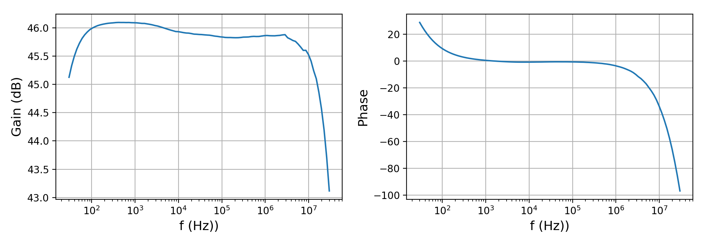
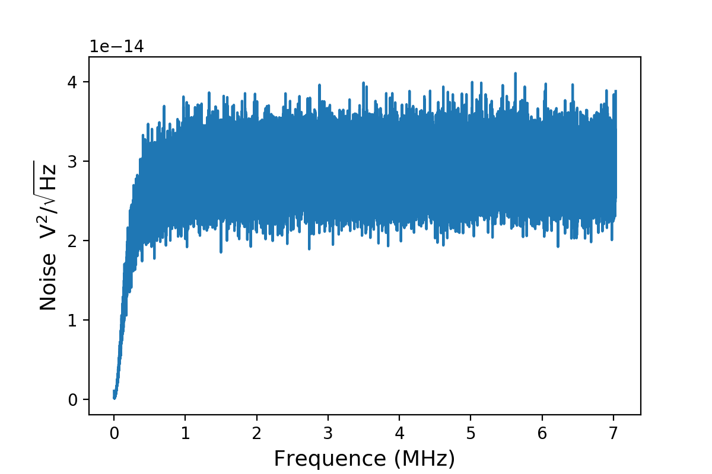
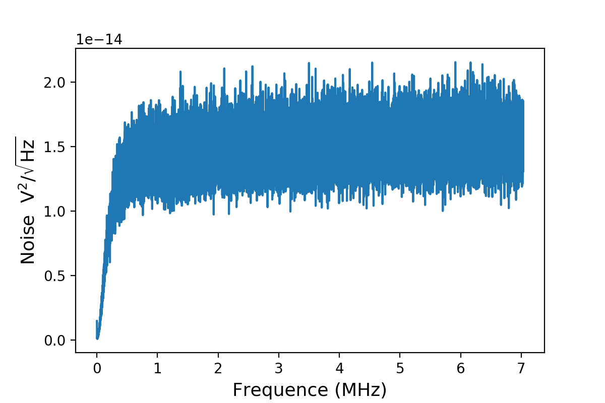

# SA421F5低噪声常温放大器

[2020.11.13]

## 1. 功能：

- 频率范围：30Hz ~ 30MHz
- 放大倍数：200 倍
- 输入阻抗：1MOhm
- 输入噪声：$0.5\ \rm nV/\sqrt{Hz}$

## 2. 测试结果

使用UHF锁相放大器进行该部分的测试。

**频响：**

**50$\Omega$输入噪声** （用50Ohm的SMA头接上放大器的输入端）

**0$\Omega$输入噪声** （用0Ohm的SMA头让放大器的输入端短路）

## 3. 注意

- Use a DC power supply that restricts the current to 150 mA.
- It will take approximately 20 seconds before stable amplification is achieved. When a highly accurate measurement is required, our recommendation is 30 minutes warm up before measurement.

- Install this product as close as possible to the sensor or signal source and make the input cable as short as possible.
- Be sure to use shielded cables such as coaxial cables for input and output. Furthermore, install the input cable and output cable as far away from each other as possible (input and output coupling may cause oscillation and instability).
- Installing this product with the bottom plate connected to it on conductors, such as metals, insulates the product from the object to which it is connected, so GND loop noise can be reduced.
- If there is a product that includes a transformer, such as a DC power supply, install the sensor and this product as far away as possible from it.
- Install this product in a location where there is as little vibration as possible. When a small signal is detected, it may be subject to the influence of microphonic noise generated by the vibration of
  the cable.
- An SMA connector and semi-rigid cable are useful for reducing disturbance and noise from the outside.

 - Secure this product in a stable location.

