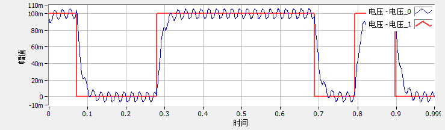
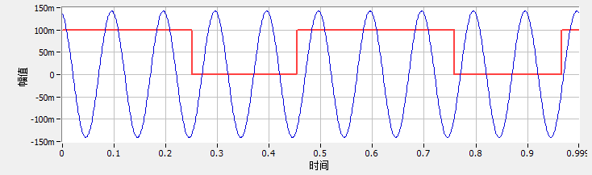

## PCI 6289 (M Series)

[2019.11.13]

##### 写在前面：

本文档讲解PCI 6289的基本使用方法，更多信息请参考使用手册 Manuel_for_DAQ_M_Series.pdf

##### 有用的学习材料（web）

- http://www.ni.com/product-documentation/5438/en/

- https://knowledge.ni.com/KnowledgeArticleDetails?id=kA00Z0000019ZWxSAM&l=en-US
- http://www.ni.com/webcast/1674/en/
- https://knowledge.ni.com/KnowledgeArticleDetails?id=kA00Z000000P6WESA0&l=en-US


#### 一、准备工作

- 将PCI 6289插入电脑的PCI插口上

- 打开NI-MAX软件，在 我的系统->设备和接口 选项下，查看是否有PCI-6289选项。如果安装正确，右击PCI-6289设备，会出现一些相关选项。如果右击没有反应，可能的解决方法：安装最新的DAQmx。

  Note：DAQmx的下载界面有 view readme选项，点击进入，可以查看该版本DAQmx支持的硬件设备

- 右击PCI-6289，点击自校准，设备会进行自校准(减小温度带来的偏差)；
  Note：Disconnect all external signals when you self-calibrate a device.

- 右击设备和接口下的PCI-6289，点击重命名，修改为"PCI6289" ，在python代码中使用"PCI6289"作为设备名，与NI-Max通讯；

- 可参考《Labview入门与实践开发100例》（作者：岂兴明 ）中【实例77】，在NI-MAX中初步使用PCI6289，并读取数据

- 完成上面步骤，说明已经可以使用PCI 6289

- 连接BNC-2110至PCI6289的输出端，后面的实验使用BNC连接线，连接BNC-2110的输出端口或者输入端口

- 安装python库函数: nidaqmx（python与DAQmx通讯）

##### 补充

- 安装DAQmx：

  - DAQmx是免费软件，可独立于Labview使用，本次安装的是NI-DAQmx 19.5版本
- 下载网址：https://www.ni.com/en-us/support/downloads/drivers/download.ni-daqmx.html#325032
  - 下载的是一个安装器，双击打开，安装推荐的所有模块
- 关于较准：You can calibrate the device to minimize AI and AO errors caused by time and temperature drift at run time. No external circuitry is necessary; an internal reference ensures high accuracy and
  stability over time and temperature changes.

##### PCI6289


##### BNC-2110


#### 二、基本使用方式

在python中使用PCI6289测量电压，代码如下：

```python
import nidaqmx
from nidaqmx.constants import AcquisitionType 

sample_per_second  = 10
with nidaqmx.Task() as task:
    task.ai_channels.add_ai_voltage_chan("PCI6289/ai0", min_val=-0.1, max_val=0.1)
    task.timing.cfg_samp_clk_timing(rate=sample_per_second, sample_mode=AcquisitionType.CONTINUOUS)
    for n in range(10):
        data = task.read(10)
        print(type(data), len(data))
```

##### 说明：

- 上例中，设置PCI连续采样
- task.read(10) 表示一次读取10个测量数据，当程序执行到此，会等待至采集卡测量到10个数据点时（本例中，每次会等待1s），该函数返回测量结果


#### 三、Resolution

见 Manuel_for_DAQ_M_Series.pdf 中的第4章。

ADC模块将模拟信号转换为数字信号。如果量程设置为-10V~10V，则可能的数据点有$2^{18}$个，在-10V~10V之间等间距分布，所以量程为 [-10V, 10V]，18-bit ADC的输出精度：
$$
\frac{10\text{V} - (-10\text{V})}{2^{18}} = 76\ \rm{\mu V}
$$
M series 的校准过程会增加5%的间距，所以最终输出结果的精度为：$76\mu \rm V \times 1.05 \approx 80 \mu \rm V $ 

##### 测试

- 打开NI MAX软件，查看PCI 6289状态良好

- 使用AI0作为输入端口，所以用导线连接AI0的芯和外皮
- 执行下面代码

```python
import nidaqmx
import matplotlib.pyplot as plt

sample_per_second  = 100000
with nidaqmx.Task() as task:
    task.ai_channels.add_ai_voltage_chan("PCI6289/ai0", min_val=-10, max_val=10)
    #min_val, max_val为输入信号的上下限，nidaqmx根据用户输入的上下限自动选择量程
    task.timing.cfg_samp_clk_timing(rate=sample_per_second)
    data = task.read(100000)
    
plt.plot(data, '+')
plt.grid()
plt.pause(0.1)
```
测量结果：


结果说明：

- 可以放大测量结果，查看横线的间距 ( ~ 80 $\mu$V)
- 可以在上面程序中修改量程（即修改 min_val 和 max_val的值），查看对应的精度
- 负载端短路，电压应该为0V，但从测量结果可以看到，噪声还是很大的，应该是ADC前面的模块产生的


####  四、模拟信号输出

PCI6289也有数字信号转模拟信号的功能。这里只简单演示输出直流信号。

（参考NI官网的指导：http://www.ni.com/webcast/1674/en/）

- 打开NI MAX软件，查看PCI 6289状态良好
- 使用AO0作为输出端口（注意：AO0端口在BNC-2110面板的第二列，倒数第二行，输出端口与输入端口的顺序是反的）
- 执行下面代码

```python
import nidaqmx

with nidaqmx.Task() as task:
    task.ao_channels.add_ao_voltage_chan("PCI6289/ao0",min_val=-1, max_val=1) 
    #设置输出电压的范围: [min_val, max_val]
    task.write(0.5) #设置输出电压为0.5V
```

- 用万用表测量AO0端口芯和皮之间的电压（为0.5V）。注意，一定要小心不要让芯和皮短路。安全起见，最好用BNC连接AO0和AI0端口，直接用PCI6289来测AO0的输出电压。


#### 五、设置低通滤波器

PCI6289的滤波器截止频率为40kHz（截止频率：衰减为3dB时，对应的频率）。

在NI MAX软件中，我的系统=>数据邻居=>NI-DAQmx任务=>我的电压任务 中，可以看到低通滤波的设置选项：

（新建电压任务见NI MAX软件的使用，参考《Labview入门与实践开发100例》（作者：岂兴明 ）中【实例77】）


接下来讲解如何在Python中设置PCI6289的低通滤波器。nidaqmx._task_modules.channels.ai_channel类中，提供了很多跟filter相关的method，但硬件设备不一定具有这些功能，直接调用这些method可能会报错。经过多次尝试，最后找到了**ai_lowpass_enable**才是对应6289的低通滤波器 (https://nidaqmx-python.readthedocs.io/en/latest/ai_channel.html)。代码如下：

```python
import nidaqmx

with nidaqmx.Task() as task:
    channel = task.ai_channels.add_ai_voltage_chan("PCI6289/ai0", min_val=-10, max_val=10)
    #---- 修改量程 ----
    print("Range_high: ", channel.ai_rng_high)
    print("Range_low:  ", channel.ai_rng_low)
    channel.ai_rng_high = 0.01
    channel.ai_rng_low = -0.01
    print("Range_high: ", channel.ai_rng_high)
    print("Range_low:  ", channel.ai_rng_low)
    #---- 设定滤波器 ----
    print("Filter: ", channel.ai_lowpass_enable) #默认关闭滤波器
    channel.ai_lowpass_enable = True
    print("Filter: ", channel.ai_lowpass_enable)
```

Output：

```python
Range_high:  10.0
Range_low:   -10.0
Range_high:  0.1
Range_low:   -0.1
Filter:  False
Filter:  True
```


#### 六、设置连续测量或有限次测量

参考：https://knowledge.ni.com/KnowledgeArticleDetails?id=kA00Z0000019ZWxSAM&l=en-US

```python
import nidaqmx
from nidaqmx.constants import AcquisitionType 

sample_per_second  = 100
with nidaqmx.Task() as task:
    task.ai_channels.add_ai_voltage_chan("PCI6289/ai0", min_val=-0.1, max_val=0.1)
    #task.timing.cfg_samp_clk_timing(rate=sample_per_second, sample_mode=AcquisitionType.CONTINUOUS) #设置为连续测量    
    task.timing.cfg_samp_clk_timing(rate=sample_per_second, sample_mode=AcquisitionType.FINITE, samps_per_chan=10) #设置为有限次测量，并设置测量点数
    data = task.read(10)
    
print(data)
```


#### 七、Input Circuitry

见 Manuel_for_DAQ_M_Series.pdf 中的第4章。


##### 模块说明：

（摘抄自 Manuel_for_DAQ_M_Series.pdf 的第4章）

- MUX: Each M Series device has one analog-to-digital converter (ADC). The multiplexers (MUX) route one AI channel at a time to the ADC through the NI-PGIA.
- NI-PGIA: Instrumentation Amplifier. The NI programmable gain instrumentation amplifier (NI-PGIA) is a measurement and instrument class amplifier that minimizes settling times for all input ranges. The NI-PGIA can amplify or attenuate an AI signal to ensure that you use the maximum resolution of the ADC.
- AI Lowpass Filter: NI 628x devices have a programmable filter with a cutoff frequency of 40 kHz that can be enabled. If the programmable filter is not enabled, the cutoff frequency is fixed at 750 kHz. If the cutoff is programmable, choose the lower cutoff to reduce measurement noise. However, a filter with a
  lower cutoff frequency increases the settling time of your device, as shown in the specifications, which reduces its maximum conversion rate.

- A buffer is a temporary storage in computer memory for to-be-generated samples. Buffered acquisitions typically allow for much faster transfer rates than non-buffered acquisitions because data
  is moved in large blocks, rather than one point at a time. If data cannot be transferred across the bus fast enough, the FIFO becomes full. New acquisitions will overwrite data in the FIFO before it can be
  transferred to host memory. The device generates an error in this case. With continuous operations, if the user program does not read data out of the PC buffer fast enough to keep up with the data transfer, the buffer could reach an overflow condition, causing an error to be generated.


#### 未完成

根据说明，基本理解floating signal与ground-referenced signal的区别，但目前的使用中，没有发现这两种输入方式对测量结果有什么区别。后面的使用中，再仔细对比这两种输入方式的影响。

- What Are Floating Signal Sources?
  A floating signal source is not connected to the building ground system, but has an isolated ground-reference point.

- Issue Details
  I do not know if my input signal is a ground-referenced signal source or a floating signal source. How can I determine this?
  Solution：
  A ground-referenced signal source is connected in some way to the building ground and is, therefore, already connected to a common ground point with respect to the data acquisition (DAQ) device (assuming that the computer is plugged into the same power system.) Non-isolated outputs of instruments and devices that plug into the building power system fall into this category. A floating signal source is not connected in any way to the building ground system but, it has an isolated ground-reference point. Some examples of floating signal sources are outputs of transformers, thermocouples, battery-powered devices, optical isolator outputs, and isolation amplifiers. An instrument or device that has an isolated output is a floating signal source. You must connect the ground reference of a floating signal to your DAQ device analog input ground to establish a local or onboard reference for the signal. Otherwise, the measured input signal varies as the source floats outside the common-mode input range.


----

# 2020.7.5更新

## 一、trigger

下面实验演示trigger功能

- 用BNC线连接直流电压源的输出和采集卡的PFI12端口，即BNC-2110上的CTR 0 Out端口；
- 采集卡的AI0端口可以短路，或者接上电压源，或者断路，都可以，不影响实验；
- 然后执行下面代码，程序会等待trigger信号的输入；
- 手动改变PFI12端口的输入电压，从0V到5V，执行该操作后，程序会立马开始测量，且每隔1s返回一个测量值；

说明：程序设定的trigger信号是电压变化的上升沿，一旦检测到PFI12端口的电压上升，程序的测量任务就会马上执行。但如果100秒后，依然没有trigger信号，程序会报错：time_out，因为task.read() 函数设定超时值： timeout=100

```python
import nidaqmx
import time
import matplotlib.pyplot as plt
import numpy as np
from nidaqmx.constants import AcquisitionType, TaskMode

%matplotlib auto

with nidaqmx.Task() as master_task:
    master_task.ai_channels.add_ai_voltage_chan("PCI6289/ai0")
    master_task.timing.cfg_samp_clk_timing(1, sample_mode=AcquisitionType.CONTINUOUS)
    master_task.control(TaskMode.TASK_COMMIT) 
    master_task.triggers.start_trigger.cfg_dig_edge_start_trig("/PCI6289/PFI12") 
    # trigger source is configured
    # 注意，/PCI6289/PFI12 一定要以'/'开头
    master_task.start()
    
    time_start = time.time()
    for n in range(10):
        data = master_task.read(number_of_samples_per_channel=1, timeout=100)
        plt.scatter(time.time()-time_start, data[0], c='r')
        plt.pause(0.5)
```


## 二、模拟输出

下面例子是输出正弦波，持续100s。需要注意的是：

- task.write(y) 该命令向采集卡发送一个向量y，后面采集卡就周期执行该向量里的值，即y表示一个周期里的输出电压值。下面代码中由：y    = np.sin(2 * np.pi * f * t) 来产生。
- rate表示采集卡中DAC（digital-Analog转换）的速度（每秒执行多少次）。所以rate=f*t.size表rate应该的取值；
- 由于是DAC输出，所以用示波器查看输出电压，就会发现，实际的输出电压是台阶状。下例中，y向量里有100个点，即一个sine周期里有100个点，用示波器查看，就会看到输出电压曲线中，一个周期内有100个台阶；
- 在ni max软件中，输出模拟电压时，'待写入采样' ，表示一个电压周期里取多少个点，即下面程序中y的长度；'采样率' 即下面的rate

```python
import nidaqmx
import numpy as np
import time
from nidaqmx.constants import AcquisitionType, TaskMode

f    = 10000
T    = 1/f
t    = np.linspace(0,T,100)
y    = np.sin(2 * np.pi * f * t)
rate = f*t.size

with nidaqmx.Task() as task:
    task.ao_channels.add_ao_voltage_chan('PCI6289/ao0')
    task.timing.cfg_samp_clk_timing(rate=rate,sample_mode=AcquisitionType.CONTINUOUS)   
    task.write(y) # analog output buffer is filled with sine wave
    task.control(TaskMode.TASK_COMMIT) # analog output port is committed
    task.start()
    time.sleep(100) 
```


## 三、设备同步

参考资料：

- https://www.ni.com/en-us/support/documentation/supplemental/18/real-time-system-integration--rtsi--and-configuration-explained.html

  如何在NI-Max中注册RTSI连接线

- https://www.ni.com/en-us/support/documentation/supplemental/06/timing-and-synchronization-features-of-ni-daqmx.html

  Multi-Device Synchronization 在Labview中的示例

实验步骤：

- 用RTSI线连接PCI6289和PCI6230，打开NI-MAX，注册RTSI线，并将两个采集卡PCI-6289和PCI-6230添加到RTSI线中；
- 用其他设备（这里使用锁相放大器）输出正弦电压驱动，频率为50kHz（注意PCI6230的最大采样率是250kHz），然后将正弦驱动输入PCI6289和PCI6230的AI0端口；
- 执行下面代码，采集电压数据，并通过函数拟合，找到相位差，查看同步效果；

Note：

- 下面代码中，使设备同步的关键是：设定PCI6230的时钟时，选择时钟源source='/PCI6289/ai/SampleClock'，该时钟源是通过RTSI线输入到PCI6230的。也可以尝试不设定source，即使用PCI6230自带的时钟，查看采样结果的同步效果；

- 一开始检验是否同步时，我是直接把两个测量值相减，发现高频时，误差比较大，大约在0.02V左右。但仔细思考觉得不妥，高频时噪声更大，而且有一根输入线没有做屏蔽。所以后来使用函数拟合的方法，发现两个设备的时间误差在1e-7 s左右（平均效果），已经是非常不错了；

```python
""" You can acquire analog inputs simultaously from two different  DAQ device""" 
import nidaqmx
import numpy as np
from nidaqmx.constants import AcquisitionType, TaskMode


Rate          = 200000
Sample_to_read= 10000
t_vec         = np.linspace(0, Sample_to_read/Rate, Sample_to_read)

with nidaqmx.Task() as master_task, nidaqmx.Task() as slave_task:
    master_task.ai_channels.add_ai_voltage_chan("PCI6289/ai0")
    slave_task.ai_channels.add_ai_voltage_chan("PCI6230/ai0")

    master_task.timing.cfg_samp_clk_timing(Rate, 
              sample_mode=AcquisitionType.FINITE,samps_per_chan=Sample_to_read)
    slave_task.timing.cfg_samp_clk_timing(Rate, source='/PCI6289/ai/SampleClock', 
              sample_mode=AcquisitionType.FINITE,samps_per_chan=Sample_to_read)
    
    slave_task.start()
    master_task.start()
    
    #for n in range(10):
    master_data = np.array(master_task.read(Sample_to_read))
    slave_data = np.array(slave_task.read(Sample_to_read))
```

查看同步效果：

拟合函数$A\sin(2\pi f t+\phi)$，对比两个采集卡数据的幅值$A$和相位差$\phi$，以及该相位差对应的时间差$\Delta t = \Delta\phi / (2\pi f)$。

```python
from scipy.optimize import curve_fit

def func(t, A, phi):
    freq = 50e3
    return A*np.sin(2*np.pi*freq*t + phi)

[popt_master, _] = curve_fit(func, t_vec, master_data)
[popt_slave, _]  = curve_fit(func, t_vec, slave_data)

#拟合结果，A=popt_master[0]，phi=popt_master[1]
print(popt_master, popt_slave)

#时间差
freq    = 50e3
delta_t = (popt_slave[1] - popt_master[1]) / 2/np.pi/freq
print("delta_t: ", delta_t)
```


## 四、关于nidaqmx (Python Package)

- start()

  Transitions the task to the running state to begin the measurement or generation. Using this method is required for some applications and is optional for others. 

  If you do not use this method, a measurement task starts automatically when the DAQmx Read method runs. The autostart input of the DAQmx Write method determines if a generation task starts automatically when the DAQmx Write method runs.


## 五、关于负载阻抗

根据说明书，当需要同时测量多通道的电压时，负载阻抗不能太大，否则通道间的关联会很强（似乎跟采集卡的内部电容相关，充放电？）。在后面的实验中，如果要测量小信号，即使是单通道测量，负载阻抗最好也不要太大（应该小于1k欧姆）。

在下面的测试中，一个通道输入方波，另一个输入正弦波。从测试结果可以看到，如果负载阻抗太大，其中一个通道的测量结果失真很严重，趋近于另一个通道的信号。减小阻抗口，两个通道才可以进行独立测量。

双通道大阻抗测试



双通道小阻抗测试



