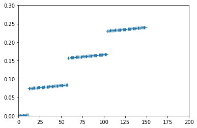

# 数字锁相放大器UHF(600MHz)的使用

[2020.7.4]

## 一、如何快速入门

### 1. Labone的使用

1. 下载并安装Labone软件（网址：https://www.zhinst.com/ch/support/download-center）；

   Note：在linux中安装labone后，ziDataServer是一直后天运行的，只需要在终端执行ziWebServer命令，然后在浏览器上打开http://127.0.0.1:8006/，即可使用labone应用。

2. 用USB线连接UHF和电脑主机；

3. 打开UHF，在Labone软件中应该会显示UHF为Available，然后打开该仪器的控制界面（浏览器上操作）；

4. 如果成功地执行了上面操作，那么可以从UHF说明书的第3章开始阅读，重点是3.1和3.2，其他部分可以忽略；

5. 如果没能用labone成功连接UHF，或者打开UHF的控制界面，则需要查看说明书的第1、2章，排查错误；

6. 学完3.1和3.1后，可以前往第6章节，学习信号处理的基本知识；

7. 之后有问题再去查看说明书的其他内容

### 2. 远程控制

**驱动下载：**

 - https://pypi.org/project/zhinst  #pypi上下载

 - https://www.zhinst.com/americas/en/support/download-center

     官网下载，包含Labview、Matlab、Python等API文件，文件中包含对应语言的实例程序，是非常好的学习资料。

   

**具体使用（以Python为例）：**

1. 下载库函数zhinst

2. 使用pip安装；

3. 在zhinst的安装路径中，有示例程序，挺丰富的，尝试执行并修（重点是common文件夹中的例子）；

   查看安装位置：

   ```python
   import zhinst
   print(zhinst.__file__)
   #我的输出结果：C:\Users\LAB\Anaconda3\lib\site-packages\zhinst\__init__.py
   ```

4. 根据自己需要，学习相关python示例，然后就可以正式使用了；

5. 在labone中的每次操作，对应控制代码就会出现在labone的下方（该功能非常方便）。例如，修改通道2中的参照信号频率为100Hz，labone的下方就会显示`ziDAQ('setDouble', '/dev2374/oscs/1/freq', 100);`，对应的python代码就是：`daq.setDouble('/dev2374/oscs/1/freq', 100)`。set函数的第一个参数为UHF的目标节点，第二个参数为该节点的值。如果值是整数，则使用`setInt()`函数，如果为浮点数，则使用`setDouble()`。


## 二、修改参照信号

### 1. 同步两通道的参照信号

原因：在锁相交叉测量噪声的实验中，需要两个通道的参照信号同步（不能有相位差）。

Labone中的操作：在本示例操作中，我们让通道1的参照信号跟随通道2的参照信号，设置好后，实验中只需要改变通道2的参照信号即可。在labone的Lock-in Tab中，选择第4个demod，设置其reference mode为`ExtRef`，然后在相同界面内设置Signal Input为`phi Demod 8`。然后就可以看到通道1中的参照信号频率与通道2的频率始终相等。也可以用锁相测量的方法查看相位是否一样，即相同的AC信号，两个通道的测量结果的相位应该是接近的。（注意，同步两通道的参照信号不需要外部线路的连接）

Python中对应的代码：

```python
ref_synchronize_setting = [
    ['/dev2374/extrefs/0/enable', 1],
    ['/dev2374/demods/3/adcselect', 11]]
daq.set(ref_synchronize_setting)
time.sleep(1)                    #等待一定时间，完成设置
```

**Notes:** 在信号频率较高时，例如大于10MHz，该同步方法将失效，两通道测量同一信号，出现明显相位差（可能原因：说明书p72）。更好的方式是使用外部信号源，接入Ref/Trigger，作为两通道的参照信号。


### 2. 使用外部参照信号

参考说明书Page73，Section 3.2.4 Using Ref / Trigger Input and Output for Referencing

**步骤：**

1. 将用微波线将外部参照信号接入Ref/Trigger（这里以Ref/Trigger 1为例，说明书中Figure 3.9）

2. 如果Signal Input1作为待测信号的输入端，则Demod4用于设置参照信号源：

<div align=center>   </div>

3. 再将Demod 1,2,3中的某一个用于锁相测量（不确定还能否使用Demod4来执行锁相测量）


**零碎的知识点：**

- 最好使用方波来同步UHF中的参照信号，因为方波的上升沿更陡，触发更精准。如果使用正弦波，可能存在明显的相位差；

- 下图为Refernce选择为External Reference 或者 internal Refernce（Manual）时，Oscillator图标的区别

<div align=center></div>

<div align=center></div>

- 当Reference Mode选择为ExtRef时，osc会根据外部的输入信号，自动生成与之匹配的reference signal，该过程需要一定时间。且，此时Osc的Freq项变灰色，表示不能手动修改，因为它应该由外部信号决定。

  说明书p72: Note that the external reference signal is never used directly for demodulation. Instead, the frequency and phase of the external reference signal is mapped to one of the internal oscillators first through an internal phase-locked loop. This internal oscillator can then serve as a reference for any of the demodulators. This mapping procedure is implemented with an automatic bandwidth adjustment that assures optimum operation over the whole frequency  range for a broad variety of signal qualities in terms of frequency stability as well as the signal-to-noise ratio.


## 三、一些Python示例程序

- **使用poll()读取锁相测量结果**

  数据量较大时，使用该函数读取数据

  ```python
  import zhinst.utils
  import time
  import numpy as np
  
  device_id    = 'dev2374'
  apilevel     = 6
  (daq, device, _) = zhinst.utils.create_api_session(device_id, apilevel)
  
  
  # Unsubscribe any streaming data.
  daq.unsubscribe('*')
  daq.sync()
  
  
  # Poll the subscribed data from the data server. Poll will block and record
  # for poll_length seconds.
  poll_length = 0.1  # [s]
  poll_timeout = 500  # [ms]
  poll_flags = 0
  poll_return_flat_dict = True
  
  # Subscribe to the demodulator's sample node path.
  path1 = '/dev2374/demods/0/sample'
  daq.subscribe(path1) #UHF的DEMOD0从这里开始记录数据 
  path2 = '/dev2374/demods/4/sample'
  daq.subscribe(path2) #UHF的DEMOD4从这里开始记录数据
  
  #wait
  time.sleep(1)  #等待1s，后面返回这1s时间内的采集数据
  
  #poll data
  sample = daq.poll(poll_length, poll_timeout, poll_flags, poll_return_flat_dict)
  # Unsubscribe from all paths.
  daq.unsubscribe('*')
  
  #data
  clockbase = float(daq.getInt('/dev2374/clockbase'))
  #channel 1
  X1_vec     = sample[path1]['x']*np.sqrt(2) 
  Y1_vec     = sample[path1]['y']*np.sqrt(2)
  timestamp1 = sample[path1]['timestamp']
  t1_vec     = (timestamp1 - timestamp1[0])/clockbase
  #channel 2
  X2_vec     = sample[path2]['x']*np.sqrt(2) 
  Y2_vec     = sample[path2]['y']*np.sqrt(2)
  timestamp2 = sample[path2]['timestamp']
  t1_vec     = (timestamp1 - timestamp1[0])/clockbase
  ```

- **getSample()的使用** （数据量小的时候）

  修改自官方示例：/zhinst/examples/common/example_connect.py

  ```python
  from __future__ import print_function
  import numpy as np
  import zhinst.utils
  
  device_id = 'dev2374'
  
  apilevel = 6
  (daq, device, _) = zhinst.utils.create_api_session(device_id, apilevel)
  
  #zhinst.utils.api_server_version_check(daq)
  ##Returns True if the versions of API and Data Server match, otherwise returns False.
  
  daq.setInt('/%s/demods/0/enable' % device, 1)
  # Enable the demodulator.
  # 0表示第一个demods
  # 1表示True，如果改为0，表示关闭该node
  
  
  daq.setDouble('/%s/demods/0/rate' % device, 100)
  # Set the demodulator output rate.
  
  daq.sync()
  #Ensures that get and poll commands return data which was recorded 
  #after the setting changes in front of the sync command.
  
  sample = daq.getSample('/%s/demods/0/sample' % device)
  # Obtain one demodulator sample. If the demodulator is not enabled (as
  # above) then the command will time out: we'll get a RuntimeError showing
  # that a `ZIAPITimeoutException` occured.
  
  [X, Y] = [sample['x'][0], sample['y'][0]]
  print("Measured RMS: X, Y = ", X, Y)
  ```
  
- **简单的锁相测量**

  关闭全部设置，然后一次性输入参数，完成简单的锁相放大所需要的全部设置

  ```python
  from __future__ import print_function
  import times
  import numpy as nps
  import zhinst.utils
  
  device_id = 'dev2374'
  apilevel = 6 
  (daq, device, props) = zhinst.utils.create_api_session(device_id, apilevel)
  
  #zhinst.utils.api_server_version_check(daq)
  
  # Create a base configuration: Disable all available outputs,demods, scopes,...
  zhinst.utils.disable_everything(daq, device)
  
  amplitude     = 0.1
  out_channel   = 0
  out_mixer_channel = zhinst.utils.default_output_mixer_channel(props)  #没懂
  in_channel    = 0
  demod_index   = 0
  osc_index     = 0
  demod_rate    = 10e3
  time_constant = 1e-6
  exp_setting = [['/%s/sigins/%d/ac'           % (device, in_channel), 0],
                 ['/%s/sigins/%d/range'        % (device, in_channel), 2*amplitude],
                 ['/%s/demods/%d/enable'       % (device, demod_index), 1],
                 ['/%s/demods/%d/rate'         % (device, demod_index), demod_rate],
                 ['/%s/demods/%d/adcselect'    % (device, demod_index), in_channel],
                 ['/%s/demods/%d/order'        % (device, demod_index), 4],
                 ['/%s/demods/%d/timeconstant' % (device, demod_index), time_constant],
                 ['/%s/demods/%d/oscselect'    % (device, demod_index), osc_index],
                 ['/%s/demods/%d/harmonic'     % (device, demod_index), 1],
                 ['/%s/oscs/%d/freq'           % (device, osc_index), 400e3],
                 ['/%s/sigouts/%d/on'          % (device, out_channel), 1],
                 ['/%s/sigouts/%d/enables/%d'  % (device, out_channel, out_mixer_channel), 1],
                 ['/%s/sigouts/%d/range'       % (device, out_channel), 1],
                 ['/%s/sigouts/%d/amplitudes/%d' % (device, out_channel, out_mixer_channel), amplitude]]
  daq.set(exp_setting)
  
  # Wait for the demodulator filter to settle.
  time.sleep(10*time_constant)
  
  #sync and get data
  daq.sync()
  sample = daq.getSample('/%s/demods/%d/sample' % (device, demod_index))
  
  #show result
  print("Measured RMS: X,Y = ", sample['x'][0], sample['y'][0])
  ```

- **single_scope** 

  设置并读取scope （single, 非trig） 数据。在Juptyter Notebook中执行下面三部分：

  **1. 初始化仪器**

  初始化仪器（关闭所有功能），执行该部分代码后，需要手动连线，将信号输入端口：singal input 1。

  ```python
  from __future__ import print_function
  import time
  import numpy as np
  import zhinst.utils
  
  
  device_id    = 'dev2374'
  scope_length = 2**12
  in_channel   = 0
  
  apilevel = 6
  (daq, device, _) = zhinst.utils.create_api_session(device_id, apilevel)
  zhinst.utils.disable_everything(daq, device)
  ```
  
  **2. 设置scope**
  
  ```python
  zhinst.utils.sigin_autorange(daq, device, in_channel) #调整输入端的range（ADC前的放大器）
  # Perform an automatic adjustment of the signal inputs range based on the
  # measured input signal's amplitude measured over approximately 100 ms.
  # This is important to obtain the best bit resolution on the signal inputs
  # of the measured signal in the scope.
  
  #==========================================================================
  # Configure the scope and obtain data with triggering disabled.
  daq.setInt('/%s/scopes/0/length' % device, scope_length)
  daq.setInt('/%s/scopes/0/channel' % device, 1)
  daq.setInt('/%s/scopes/0/channels/%d/bwlimit' % (device, in_channel), 1)
  daq.setInt('/%s/scopes/0/channels/%d/inputselect' % (device, in_channel), 0)
  daq.setInt('/%s/scopes/0/single' % device, 1)
  daq.setInt('/%s/scopes/0/time' % device, 0)
  daq.setInt('/%s/scopes/0/segments/count' % device, 1)
  
  
  #trigger
  daq.setInt('/%s/scopes/0/trigenable' % device, 0)
  daq.setDouble('/%s/scopes/0/trigholdoff' % device, 0.050)
  daq.setInt('/%s/scopes/0/segments/enable' % device, 0)
  daq.sync()
  
  #==========================================================================
  # Now initialize and configure the Scope Module.
  scopeModule = daq.scopeModule()
  scopeModule.set('mode', 1)
  scopeModule.set('averager/weight', 1) #   weight=1 - don't average.
  scopeModule.set('historylength', 1)
  scopeModule.subscribe('/dev2374/scopes/0/wave')
  ```
  
    **3. 读取一次scope的数据**
  
  ```python
  # Tell the module to be ready to acquire data; reset the module's progress to 0.0.
  scopeModule.execute()
  
  # Enable the scope: Now the scope is ready to record data upon receiving triggers.
  daq.setInt('/%s/scopes/0/enable' % device, 1)
  daq.sync()
  
  start = time.time()
  timeout = 5  # [s]
  records = 0
  # Wait until the Scope Module has received and processed the desired number of records.
  while (records < 1):
      time.sleep(0.1)
      records = scopeModule.getInt("records")
      #progress = scopeModule.progress()[0]
      if (time.time() - start) > timeout:
          print("\nTimeout!\n")
          break    
  
          # Stop the module; to use it again we need to call execute().
          scopeModule.finish()  #在读取数据前停止module，防止读取数据都继续
  
          # Read out the scope data from the module.
          daq.setInt('/%s/scopes/0/enable' % device, 0)
  
  
  
          data_return = scopeModule.read(True)['/dev2374/scopes/0/wave']
          voltage_vec = data_return[0][0]['wave'][0]
          delta_t     = data_return[0][0]['dt']
  ```
  


## 四、一些注意事项

 - ！非常重要 ！用采集卡测量高频电压信号时，最好不要让输入阻抗大于1k欧姆！

 - ！非常重要 ！锁相测量中，时间常数非常重要，用于设定低频滤波器的带宽（也可以理解成求平均值，时间常数越大，低通滤波器截止频率越小，用来平均的点数越多）

 - 设置autorange时，设备需要时间调整，一次最好只设置一个signal in的autorange，然后等待5s，再设置下一个。否则后面一个命令可能被忽视

 - 将输入口短路，然后测量基础噪声，大约是 $25\times10^{-18} V^2/Hz$（与说明书上$4 \rm nV/\sqrt{Hz}$ 相符）

- 6.4 节 Full Range Sensitivity 很有意思！居然利用噪声来提高ADC的灵敏度！以及科普人眼如何观测单光子

- *LaboneProgrammingManual* 5.3. LabOne Python API Tips and Tricks 很有用

- PLL: phase-locked loop

- API LEVEL:  The last parameter to specify, the API level, specifies the version of the API to use for the session. In short, an API Level of 1 must be used for HF2 devices and an API Level 6 is recommended for other instruments. Since the default API Level is 1, it is necessary to specify this parameter for UHF, MF   and HDAWG instruments.

- sync(): Synchronize all data path. Ensures that get and poll commands return data which was recorded after the setting changes in front of the sync command. This sync command replaces the functionality of all syncSet,  flush, and echoDevice commands.

-   getSample(path_to_node_str)

  ```python
  sample = daq.getSample('/%s/demods/0/sample' % device)
  X = sample['X'][0]
  Y = sample['Y'][0]
  #意：sample['phase']的含义不清楚，并不等于测量的电压相位
  ```

  


## 五、问题

- 将某个demodulator的数据转移到电脑上，设置data transfer的速度时，400k Sa/s下，数据是连续的。大于该值，每次获取的数据，时间上有明显的分段！

  ```python
  import zhinst.utils
  import matplotlib.pyplot as plt
  
  #===========================
  device_id    = 'dev2374'
  apilevel     = 6
  (daq, device, _) = zhinst.utils.create_api_session(device_id, apilevel)
  zhinst.utils.disable_everything(daq, device)
  
  #===========================
  #setting
  daq.setInt('/dev2374/demods/0/enable', 1)
  daq.setDouble('/dev2374/demods/0/rate', 20e6)
  daq.setInt('/dev2374/demods/4/enable', 1)
  daq.setDouble('/dev2374/demods/4/rate', 20e6)
  
  #ziDAQ('setDouble', '/dev2374/demods/0/rate', 10000000);
  
  daq.unsubscribe('*')
  daq.sync()
  
  #time.sle
  daq.subscribe('/dev2374/demods/0/sample')
  daq.subscribe('/dev2374/demods/4/sample')
  
  data = daq.poll(1, 500, 0, True)
  data.keys()
  
  #===========================
  #get data
  clockbase = float(daq.getInt('/dev2374/clockbase'))
  timestamp = data['/dev2374/demods/0/sample']['timestamp'] 
  t_vec     = (timestamp - timestamp[0]) / clockbase
  
  #===========================
  %matplotlib inline
  plt.plot(t_vec/1e-3, '+')
  plt.ylim([0,0.3])
  plt.xlim([0,200])
  ```

<div align=center>  </div>

 - 为什么低频时（100Hz），UHF的输出直接接输入，锁相测量的输入与输出幅值不相等（Gain=0.8）
