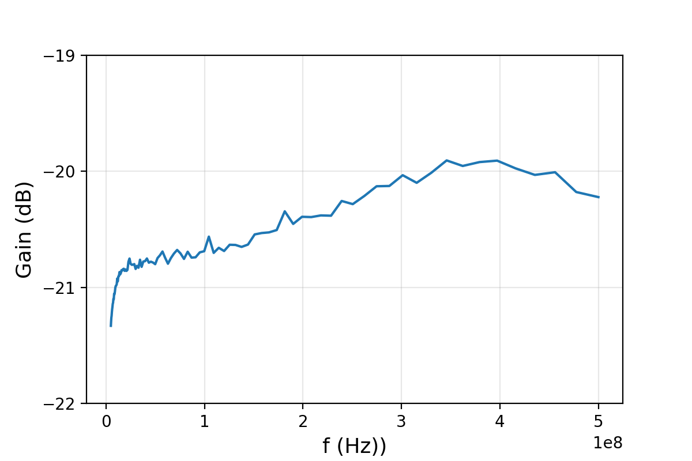

# 公分器 (毅鑫奥达)

[2020.11.13]

（淘宝上购买的，具有隔离效果的公分器）

**功能：**

- 频率范围：5 ～ 1000MHz

- 隔离度：20 dB （输入端50Ohm阻抗匹配时）

**测试结果：**

（使用UHF锁相放大器测量）

1. 频响

   50Ohm SMA头接上其中一个输出端，测量另一个输出端与输入端之间的频响

   

2. 隔离

   50Ohm SMA头接上输入端，测量一个输出端与另一个输入端之间的频响

   

   