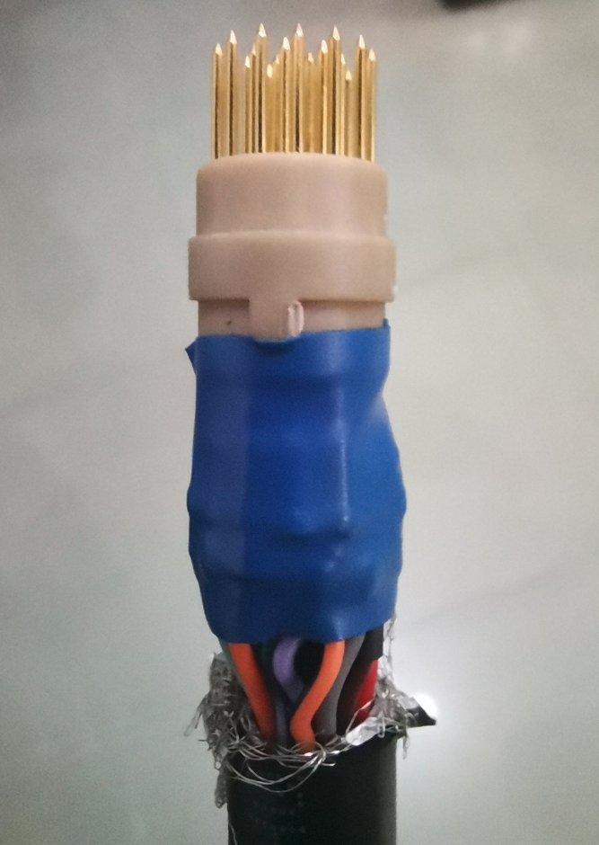

# 如何制作BNC转接盒（更新）

[2021.4.16]

最近组装了一个用液氮温区的测量杆，需要一个新的转接盒，正好弥补上一个转接盒的一些缺陷。这里只讲新转接盒的一些区别，大部分制作细节见下面的老转接盒。（完整的CAD图纸以及Freecad 3D模型需要到我的github相应文件夹查看。）

**主要区别**

- 使用DB25接头。盒子只有24个接口，所以DB25有一个是多余的，可以用来接地或者悬空。

  

- 用DB25连接线实现转接功能。直接在网上购买公对公的DB连接线，然后从中间分开。一头是DB25接头，另一头为真空插头。

  

- 内部不再使用一整块PCB，而是使用4块小的PCB连接线路。

  

- 安装BNC接头以及开关钮子的地方，用砂纸打磨铝盒表面，增强电接触。

-----------------------

-----------------------------------------------------------------------

# 如何制作BNC转Lemo的接线盒（老版本）

[2020.11.28]

完整的CAD图纸以及Freecad 3D模型见CAD文件夹。

## 一、目标

稀释制冷机上新安装了一个电贯穿，其中一个是Lemo 24Pin的接头，而实验室的仪器以及连接线基本都是BNC或者SMA接头，所以需要一个BNC转Lemo的接线盒。最终成品如下图所示：

## 二、器材购买

### 1. 购买Lemo插头

根据电贯穿上的lemo插座型号，确定要买的插头。下面是购买的连接和图片

https://item.taobao.com/item.htm?spm=a1z09.2.0.0.67002e8d5niR9B&id=590228108954&_u=s1kvjlgv0f09

### 2. 购买屏蔽线

Lemo接头到了后，测量其接入屏蔽线那一端的，孔的尺寸，用来确定屏蔽线的型号。下面是购买的连接和图片

https://item.taobao.com/item.htm?spm=a1z09.2.0.0.3fc92e8dxxFUc3&id=13510737983&_u=s1kvjlgvd887

**说明：** 由于对屏蔽线的精确尺寸，以及接上Lemo头后的实际效果没有把握，所以可以多买几种型号的线，毕竟太便宜了。比如本次，我购买了24芯0.15平方，和24芯0.2平方，两种线（长度都是2米）。拿到包裹后发现，0.2平米，即粗一点的线与Lemo接头刚好卡得很紧，很稳定。

### 3. 购买屏蔽线与接线盒之间的卡扣

根据屏蔽线的外尺寸确定卡扣的型号。注意多买两种，器材到手后，根据实际效果确定使用哪一个卡扣。下面是购买的连接和图片

https://item.taobao.com/item.htm?spm=a1z09.2.0.0.3fc92e8dxxFUc3&id=631645623506&_u=s1kvjlgvcaaa

### 4. 购买BNC以及开关钮子

BNC说明：接线盒的外壳，属于公共的接地端，所以购买的BNC接头也是接地端直接与接线盒的外壳相连。购买链接：

https://detail.tmall.com/item.htm?id=582832733068&spm=a1z09.2.0.0.3fc92e8dxxFUc3&_u=s1kvjlgva80a

开关钮子的购买链接：

https://item.szlcsc.com/295191.html

### 5. 设计接线盒

收到BNC头和开关钮子后，就可以开始绘制接线盒的图纸，用来确定安装孔的大小和位置（绘图软件的说明被放到了本文的最后）。在淘宝上找到专门做壳体的商店，铝盒是现成的，只需要在顶上和侧面开一些孔。需要注意的是，219mm是现成盒子的长度，可以改小，如果大于这个长度，需要订做，成本会增加（大约150块）。下面的接线盒的购买链接（界面上的标价32.5元应该是指盒子的单价，加上打孔的加工费，本次购买该铝盒子的总价是150元）：

https://item.taobao.com/item.htm?spm=a1z09.2.0.0.3fc92e8doFz2v2&id=574348612173&_u=s1kvjlgv9dbc

店铺上提供的一些尺寸参数：

前板开孔信息（用于接入屏蔽线以及卡扣）：

顶板的开孔信息（用于安装BNC和开关钮子）

## 6. PCB板的设计

首先说明，PCB板并不是必须的选择，完全可以用导线进行盒子内部的连接。只是我个人觉得这些线在里面飞来飞去，看着很凌乱，焊接也很麻烦，所以使用PCB板来实现盒子内部的连接。绘制PCB时，使用的是立创eda软件，并在嘉立创进行PCB打样。注意，每个钮子开关控制左边对应BNC的接入状态，开关向上，BNC与内部线导通，开关向下，BNC与内部线断开，并让内部线接地。立创eda的学习被放到了本文的末尾。下面是原理图和PCB设计图（顶层）：

### 7. 其他器材

- 电烙铁
- 热风枪
- 热塑管
- 圆孔排母

## 三、接线

### 1. Lemo插头连接屏蔽线

由于lemo头中的线非常密，而当时我又没有好的办法去固定屏蔽线和lemo头，所以一开始的焊接工作遇到了困难。后来的解决办法是，如下左图，先将屏蔽线全部焊进排针的孔中，再将排针焊入lemo头，并用热塑管包扎，防止短路（将热风枪温度调到100度，对着热塑管吹，它就会变小，紧紧地包住导线）。使用的排针是右图中这种很普通的型号，用钳子将排针外部的塑料壳弄碎，即可取出内部的针。

下面图是全部焊接好后的效果。由于空间有限，外圈的排针没有全部使用热塑管，所以最后用绝缘胶带将全部接头包住，防止短路。最后将lemo头的剩余部分都装上。需要额外注意的是，线的外部屏蔽层作为地线，一定要与lemo头的外壳有良好的接触。

### 2. 铝盒与屏蔽线的连接

将BNC头和开关钮子安装到铝盒的顶板上，然后安装PCB板。

最后，将屏蔽线与PCB板焊接好。

**说明：** 本次，我先焊接PCB和BNC、开关钮子，然后再焊接屏蔽线与PCB。更好的方式应该是先将屏蔽线焊接到PCB板上，再焊接BNC和开关钮子。

## 四、附录

### 1. 绘制图纸

由于本次的图纸非常简单，所以有如下三种方式来制图：

1. 在纸上手绘，然后拍照发给商家，并在淘宝上与商家沟通好；

2. 使用Librecad、Qcad等开源或免费的二维制图软件。这类软件功能较少，专注于2D制图，所以上手速度更快（相对于Autocad、Solidworks等3D绘图软件）。但遗憾的是，我没有找到合适的视频教程（所以可能学习成本并不低）；

3. 使用Freecad、Fusion360、Solidworks等3D绘图软件（如果时间充足）。我这次使用的就是Freecad，它是开源软件，所以可以放心使用。Fusion360对高校的支持很好，也可以非常方便地获取试用权限，但用旧电脑运行起来有卡，也缺少视频教程。

   如何上手这类软件？这类软件学习，怕的不是软件有多复杂，而是老师讲解不连续，跳过一些专业人士觉得简单的知识点，对于我们这些外行/零基础的学生来说，这才是最痛苦，最令人头大的困难。
   
   - Freecad：https://space.bilibili.com/103146169/
   
   - solidworks：51自学网上有非常好的付费学习课程，老师讲得很细致，没有跳跃，只需要跟着老师重复例子即可，所以难度不大。

### 2. PCB设计

本次使用的是立创eda，下面是B站上的学习链接，第一个视频20分钟，第二个大约1个小时，所以上手非常简单，强烈推荐。

- https://www.bilibili.com/video/BV1Q441167nu?from=search&seid=15052438942375279526
- https://www.bilibili.com/video/BV1EE41147yV

电路板设计的注意事项：

- 电路板上的焊盘孔尽量大一点，这样，安装的容错率高一点

- 这次是通过一整块电路板连接所有的器件。更好的方式是将该其分成4块小的电路板，每块对应下图中的一行，共6共BNC模块。这样做的好处：1. 减小绘图难度；2. 尺寸小了，PCB打样价格更低；3. 浪费更小（大PCB打样的最小数量是5块）；4. 最最重要的是，安装和拆卸会方便很多。

  

### 3. 其他

- 相对于淘宝，在立创商城这种综合性平台购买各种小的电子元件非常方便，优点有三：1. 种类多，查找快；2. 可以小批量购买；3. 开发票方便，不用每次都询问店主能不能开票。（另外，他们有立创eda，做得很不错，希望支持一下国产eda软件）

