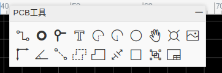

# 电路板设计

[2021.9.22]

**提前总结：**

- 涉及的电路都很简单，不需要复杂的专业知识

- 推荐软件：[立创EDA](https://lceda.cn/)

- 教程：

  - [立创EDA快速入门](https://www.bilibili.com/video/BV1Q441167nu)
  - 更多教学视频见B站：[**立创EDA**](https://space.bilibili.com/430536057?from=search&seid=13218361513756254409)

- 推荐的加工平台：[嘉立创](https://www.jlc.com/#)

- 推荐的元器件购买平台：[立创商城](https://www.szlcsc.com/) 

  种类齐全，开发票方便。

## 一、EDA软件

立创EDA是一款非常优秀的国产eda软件，可直接在浏览器上打开，所以不受操作系统的限制，而且全部功能都免费。当然，立创EDA的最大特点是：方便，对初学者友好。

## 二、如何上手

1. 学习B站上的入门视频：[立创EDA快速入门](https://www.bilibili.com/video/BV1Q441167nu)；
2. 设计一些简单电路板，如LC滤波器、运算放大器电路等，到PCB打样平台下单打样，拿到实物电路板，检查是否有设计问题。近些年PCB工厂的竞争很大，小批量订单的价格越来越低。例如，之前嘉立创有每月2单优惠，每单5元，而且包邮。近期，嘉立创推出每月2单免费，而且包邮。所以，对于学生来说，这是非常好的练手机会。
3. 焊接元器件，练习焊接，最后使用仪器测试。最后这一步非常重要，可以让我们直观感受哪些是重要因素，对结果影响很大，哪些影响不重要（原理很重要，参数范围同样重要）。

## 三、一些使用细节

- lceda分为专业版和标准版，对于初学者或者非相关专业的学生，推荐使用标准版，它能满足绝大部分需求；

- 目前看来，lceda对chrome浏览器的支持要好一些，firefox也能用，但不能查看3D模型。但暂时都不能导出3D；

- Eda提供了一些电路检查工具，但由于我们涉及的电路都很简单，所以可以肉眼检查是否存在问题；

- PCB下单步骤：

  1. 制造->PCB制版文件(Gerber) -> 在生成Gerber之前是否检查设计规则(DRC)（选择：否，生成Gerber）；

  2. 然后有两个选项：

     a. 生成Gerber （生成Gerber文件，可拿到任意工厂下单生产）；

     b. 一键下单PCB/SMT（转到嘉立创下单，我一般使用该选选项。如果提示获取eda信息失败，或者PCB下单界面没有显示板子尺寸，可重复上面操作）；

  3. 工厂下单时需要注意的（这里以嘉立创为例）：

     a. 有默认选项的地方，除了板子厚度，基本都不需要改动；

     b. 确认生产稿：不需要；

     c. SMT贴片：不需要；

     d. 开钢网：不需要；

     e. 收据/送货单：电子收据/送货单；

     f. 确认订单方式：由客户自行确认;

     g. 发票：普通电子发票；

     h. 一起发货：一起发货（省运费）；

  4. 如果需要电路板底部金属露出：

     a. 使用PCB工具中的"矩形"工具，在PCB底层放置金属层；

     

     b. 点击该金属层，然后"点击创建开窗"；

     

### 四、最想说的

我们的原则是，能用就行！所以，多尝试！
