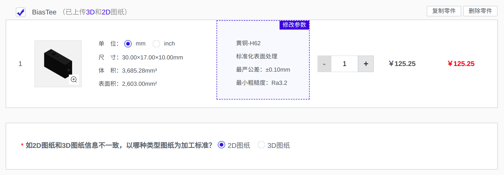
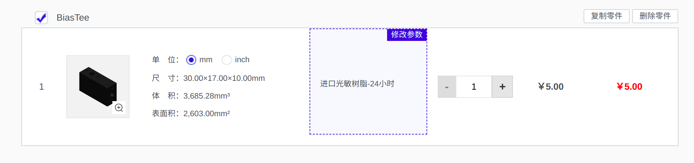
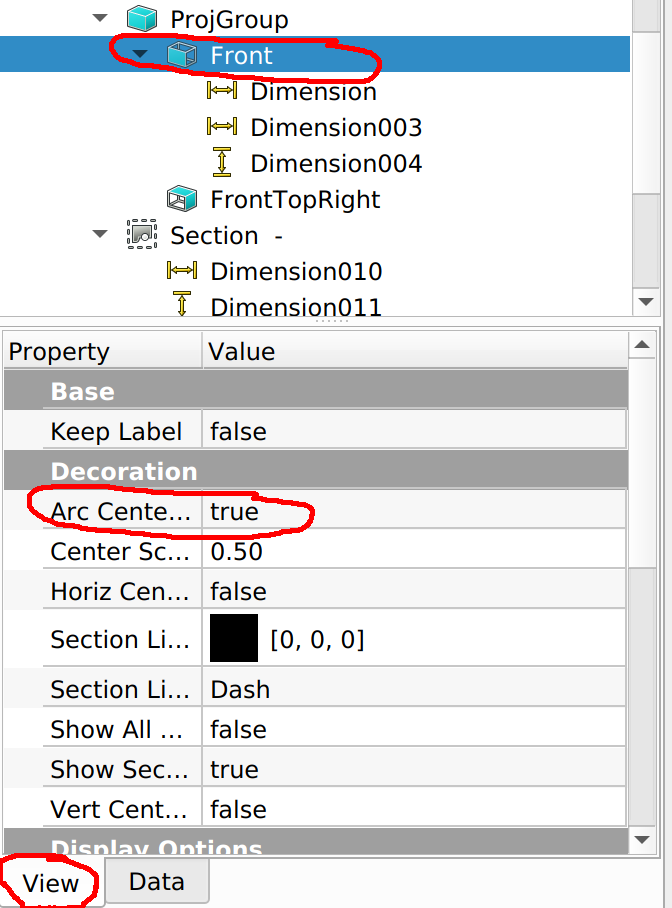
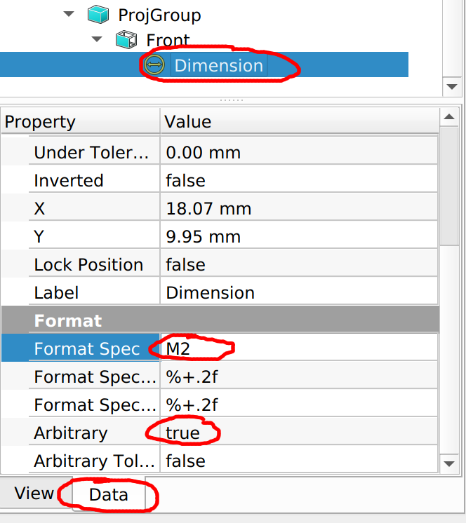
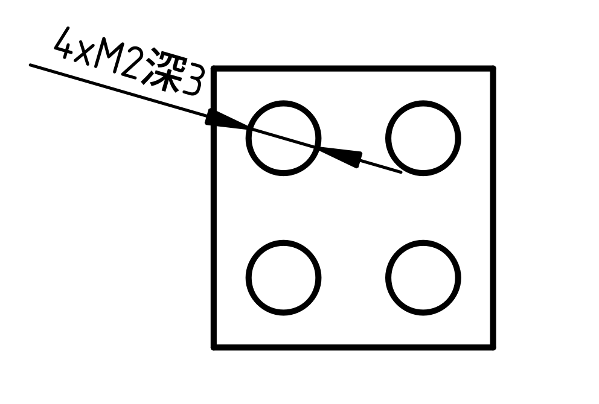
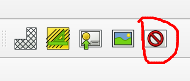
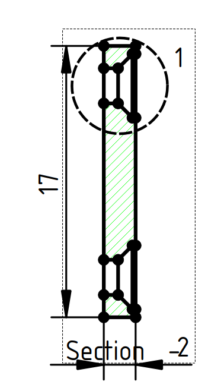
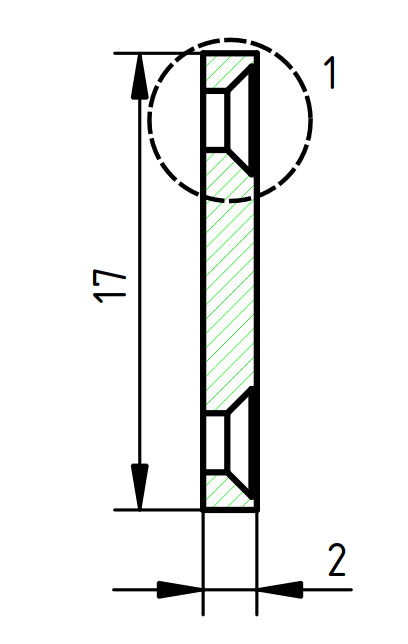
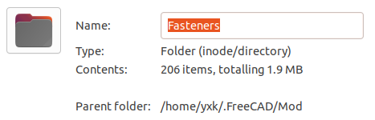

[TOC]

# 机械制图

**提前总结：**

- 需要用到的零件结构都很简单，所以加工工艺要求不高，不涉及复杂的机械知识；
- 推荐的软件：[Freecad](https://www.freecadweb.org/)；
- 教程：B站UP主[心宅下一秒](https://space.bilibili.com/103146169/)
- 推荐的加工平台：[速加网](https://www.sogaa.net/)；
- 加工类型：目前只用到了机加工和3D打印；

## 一、制图软件

Freecad是一款开源软件，可以放心使用，对Windows、Mac、Linux都有支持。如果是在linux下使用，可直接下载AppImage文件，无须安装。相对与Solidworks或者Autocad这类成熟的商业软件，Freecad的使用确实要死板一点，但我们平时也不会涉及复杂的零件，所以影响并不大。而且一个开源软件做到这种程度，刚接触时，我都感到非常惊讶。

## 二、如何上手

需要说明的是，我们要学习的只是如何使用该软件，而不是专业的机械设计知识。学习这类所见即所得软件，最好的方式是跟着视频教程练习，而且教程一定要连续，不能有跳跃。

中文互联网上关于Freecad的教学并不多，这里推荐的是B站UP[主心宅下一秒](https://space.bilibili.com/103146169/)，他分享了很多视频例子。一边看视频，一边打开软件，跟着操作即可。

需要额外说明的是，Freecad有很多模块，功能也很多，但目前为止，只用到PartDesign、Part、Sketcher、TechDraw，以及偶尔会用到Fasteners（螺纹相关）、以及A2plus（装配体）。所以对于初学者，主要学习如何3D建模，以及绘制对应的2D图纸。学习2D绘图时，也不用考虑公差、粗糙度、垂直度等专业知识，加工厂那边使用的是统一的工艺标准。

## 三、加工生产

**机加工**

- 下单网址：https://www.sogaa.net/portal/quotationCnc

- 需要的文件：3D模型的step文件，以及标注参数的2D图纸文件（建议PDF格式）。

  注意同一零件的2D、3D文件的文件名要一致。

- step是通用格式，其他建模软件都能打开，主要作用应该是向工厂的技术人员直观演示零件的构型（推测）。

- PDF文件提供零件的具体参数。我一般使用PDF格式，而非DXF的格式。因为DXF更专业，更可能出错。PDF是所见即所得，技术人员看到的，也是我看到（经过自己反复检查的），这样可以防止产生误会。

  例如，绘制M2的螺孔时，如果使用PDF格式，那么图中的圆孔大小并不重要，可以画成2mm，也可以画成1.6mm，因为只起一个演示作用，技术人员也不会通过PDF文件去测量该圆孔的尺寸。但如果是DXF文件，它会提供所有的信息，包括没有主动标注的部分。工厂的技术人员可能会直接测量这些信息，所以对图纸的要求更严格，否则容易出现误会。

- 速加网机加工的自动报价并不准确，所以提交订单后，需要人工审核，再付款。

- 2D图纸中不需要标注公差、垂直度、粗糙度等信息，加工厂按照统一的标准制作零件（标准可选）。除非一些特殊应用，该标准完全满足我们的需求。
- 如果零件要放在制冷机中，材料选择黄铜-H62。紫铜表面很容易氧化，变得非常暗沉。

**3D打印**

- 下单网址：https://www.sogaa.net/portal/3DPrinting

- 需要的文件：3D模型的step文件。

  不需要2D图纸，但如果需要添加金属螺纹，需要2D图纸表明螺纹的尺寸以及位置信息。

- 3D打印很便宜，例如放大器大小的盒子，大概就10元作用，而且生产速度非常快，基本都是第二天发货。所以很多时候可以先做一个3D打印的零件，用来验证设计是否合适，没问题后再下单机加工零件。
- 3D打印不需要提供2D图纸，只要有step文件即可，所以设计很方便。
- 速加网的3D打印自动报价是准确的，可以直接下单付款，非常方便。

## 四、关于软件使用的一些细节

- 如何绘制螺纹孔：https://www.bilibili.com/video/BV1kW411277E?from=search&seid=6772487417019947383

  需要注意的是，向工厂提供图纸时，并不需要绘制出螺纹，只要在2D图纸中标注好必要的信息即可。

- TechDraw圆心显示。使用TechDraw进行2D制图时，0.19版本的Freecad默认不显示圆圈的圆心，需要手动更改设置。如下图所示，选择对应视图，点击View，然后将Arc Center Marks属性改为true，2D图纸就会显示圆心，方便我们进行尺寸标注。

  

- TechDraw螺孔标注。目前为止，我也不清楚TechDraw是否有专门标注螺孔的功能。我的处理方法是，先标注该孔的直径，然后如下图所示，修改标注内容（M2表示2mm的螺孔）:

  

  

  

- TechDraw螺孔标注。下面左图表示，有四个相同的M2螺孔，这样就不用每个螺孔都标注。右图表示有4个相同的M2螺孔，螺孔深度为3mm，如果不标注“深3”，螺孔默认为贯穿。

  ​                                                                 

- TechDraw输出PDF。使用TechDraw完成2D制图后，点击右上角的Turn Frames View on/off按钮（如下图一所示），用于尺寸标注的辅助点、辅助线都会消失，图纸变得清爽易读，然后右击图纸空白处，即可选择输出PDF文件。

  ​                                                                      

- 软件的tools->Addon Manager可以很方便地添加插件（例如Fasteners）。如果添加失败，也可以直接在github上下载相关文件，然后放到Freecad的配置文件中。

  

## 五、其他

- 如果条件允许，也可以使用其他商业建模软件，例如Solidworks和Fusion360。

  **Solidworks**

  - 推荐教程：https://www.51zxw.net/List.aspx?cid=331

    它属于机械专业方面的教程，但老师讲得很仔细，很连贯，课程内容全是实例操作，即使是非机械专业也不用担心看不懂。该网站还有其他Solidworks的课程，应该都不错，可以尝试新一点版本的课程。

  - 优化好，对电脑硬件要求很低。

  **Fusion360**

  - 该软件对学生的支持很好，很容易得到长期的试用权限。但并不清楚在工作中使用该软件是否会有法律问题。

  - 推荐教程：无

    18年的时候试用该软件，但没找到合适的视频教程，所以直接放弃。

  - 老旧电脑运行该软件可能会卡顿。