# 如何制作差分放大器

[2021.9.22]

**结果：**

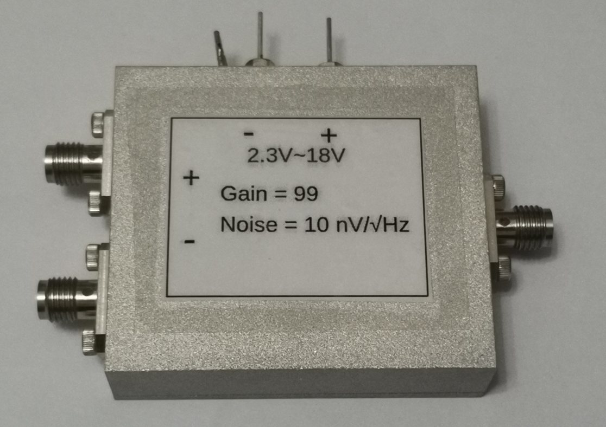

- Gain：99
- Noise：9 $\rm nV/\sqrt{Hz}$

- 频率：DC-10$\rm kHz$
- 用途：低频锁相测量
- 共模抑制比：这里没有严格测量，而是通过一个模拟实验，对比它和锁相放大器LI5650的测量结果。

## 制作过程

1. **运算放大器**：AD620

   - 这里讲一下如何确定使用该运放：到淘宝上搜差分放大器，然后看看常用的差分放大器芯片有哪些，再找到数据手册，对比性能参数，选择最适合的一款运放。最需要关注的两个点是，共模抑制比要尽量高，外部电路尽量简单。AD620运放只需要一个外部电阻，设计电路板会极其方便，它的噪声也很小（相对于噪声测量，锁相测量对放大器噪声的要求并不高）。
   - 使用普通的放大器（而非差分运放）也可以制作差分放大器，但两个输入端极其微小的不匹配就会极大地影响共模抑制比，所以尽量选择专用的差分运放。
   - 推荐的购买链接：[AD620ARZ-REEL7](https://item.szlcsc.com/10205.html)

2. **电路板制作**

   - EDA：[立创eda](https://lceda.cn/)

   - 原理图：

     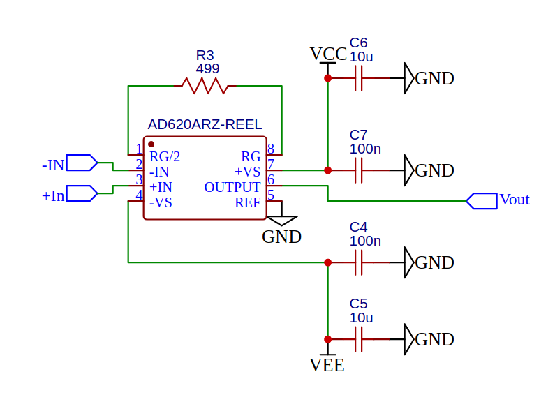

   - PCB效果图：

     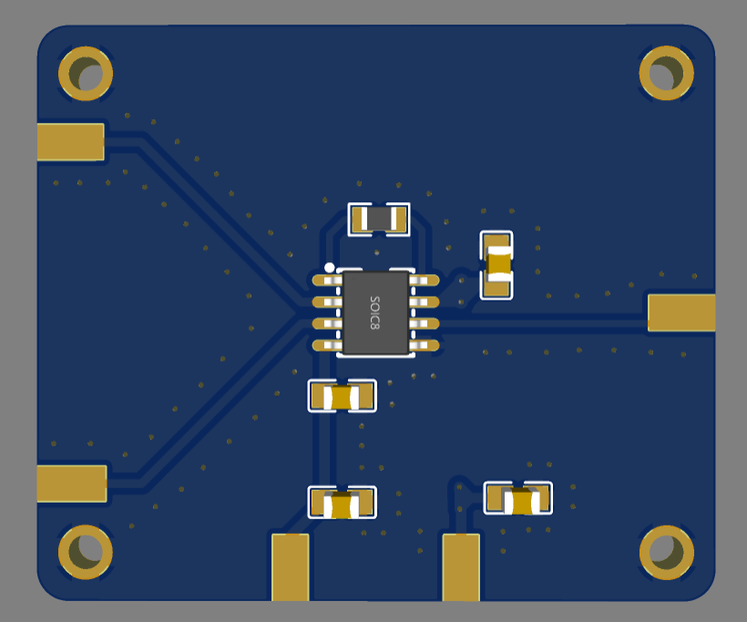

   - PCB打样：[嘉立创](https://www.jlc.com/)

   - 说明：根据数据手册，也可以在输入端添加滤波回路（但要注意电容值的选择，防止影响共模抑制比）。不过我做了一个最简单的结构，经过测试，发现效果还不错，所以接没有使用滤波。

3. **制作金属外壳**

   - CAD工具：Freecad

   - 具体的图纸（PDF格式）和3D模型（step格式）见github相应的文件夹。这里只展示装配体的3D模型：

     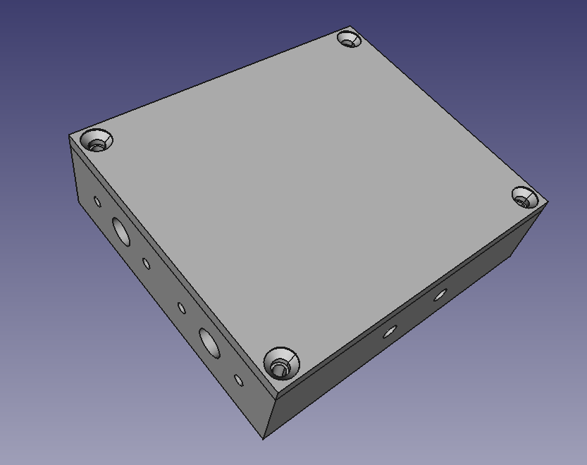

   - 制作工厂：[速加网](https://www.sogaa.net/)

     - 材料选择：铝合金-6061
     - 表面处理：喷砂-100目（一定要说明只对盒子外表面喷砂，内表面不处理）
     - 其他部分选择速加网的默认工艺

4. **测试**

   将所有的元器件焊接并组装好后，即可对其测试。

   - **Gain**（使用UHF锁相放大器测量）

     - 负输入端短路，测量正输入端

       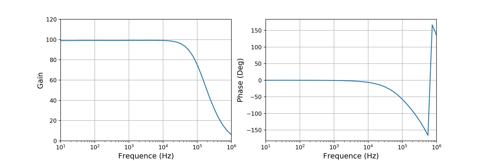

     - 正输入端短路，测量负输入端

       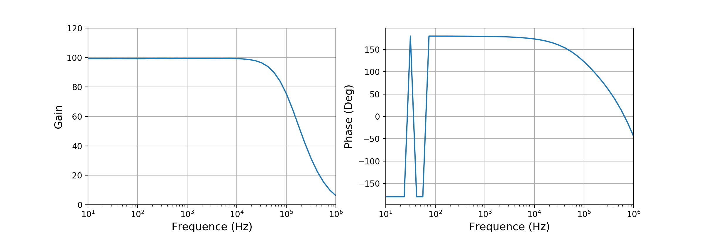

   - **Noise**（将UHF作为采集卡使用，测量噪声）

     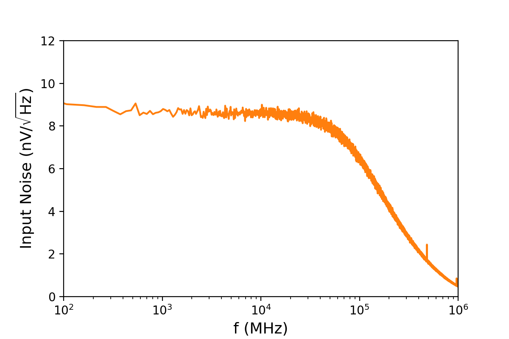

     Note:

     -  上图中的横坐标单位错了，应该是Hz，而不是MHz；
     - 为了简便，在计算放大器输入噪声时：$S_{\rm Input} = S_{\rm Measured} / \rm Gain$ ，Gain恒等于99，而不是随频率改变。所以上图中，10kHz之后的输入噪声是错的。但通带外噪声的影响远小于通带内的，所以我们只需要查看通带内的噪声行为。

   - **共模抑制比**

     这里，我们没有严格测量放大器的共模抑制比，而是模拟测量超导电阻，对比它与LI5650的测量结果。

     - LI5650差分测量

       示意图：

       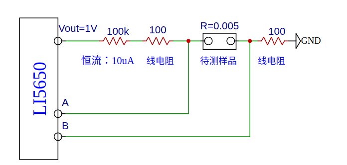

       测量结果：

       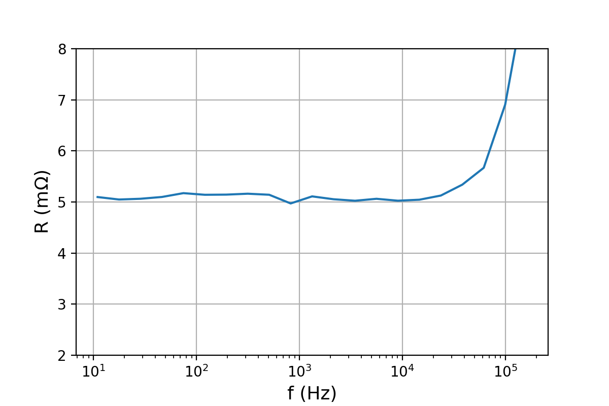

     - AD620差分放大器

       示意图：

       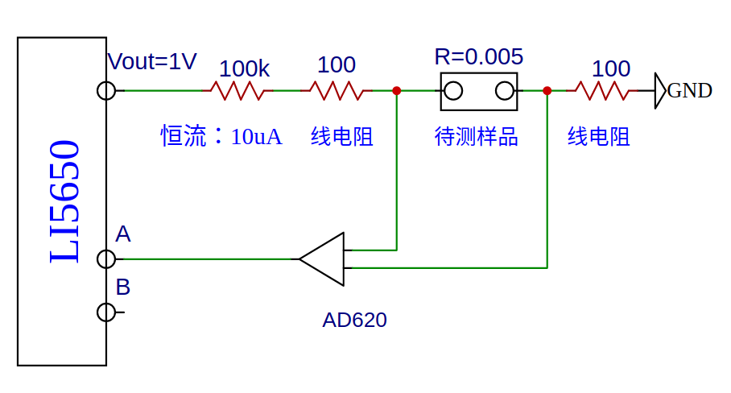

       测量结果：

       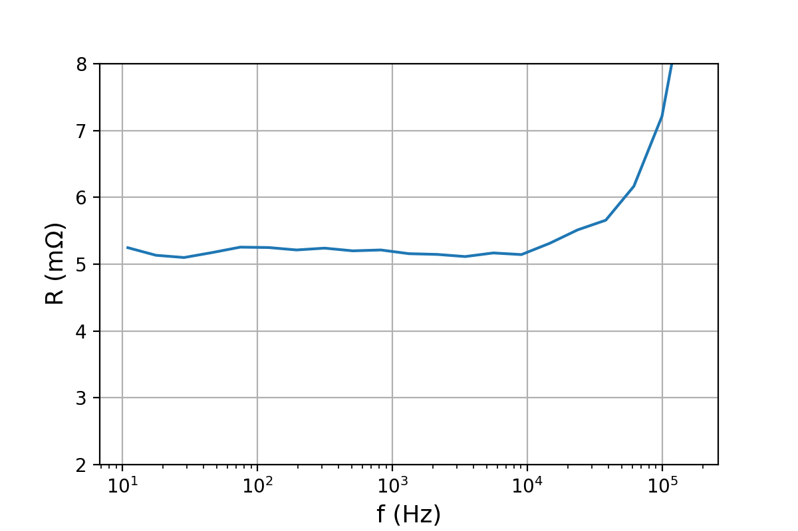

   - **其他测量数据**

     - 正输入端增益放大图

       

     - 负输入端增益的放大图

       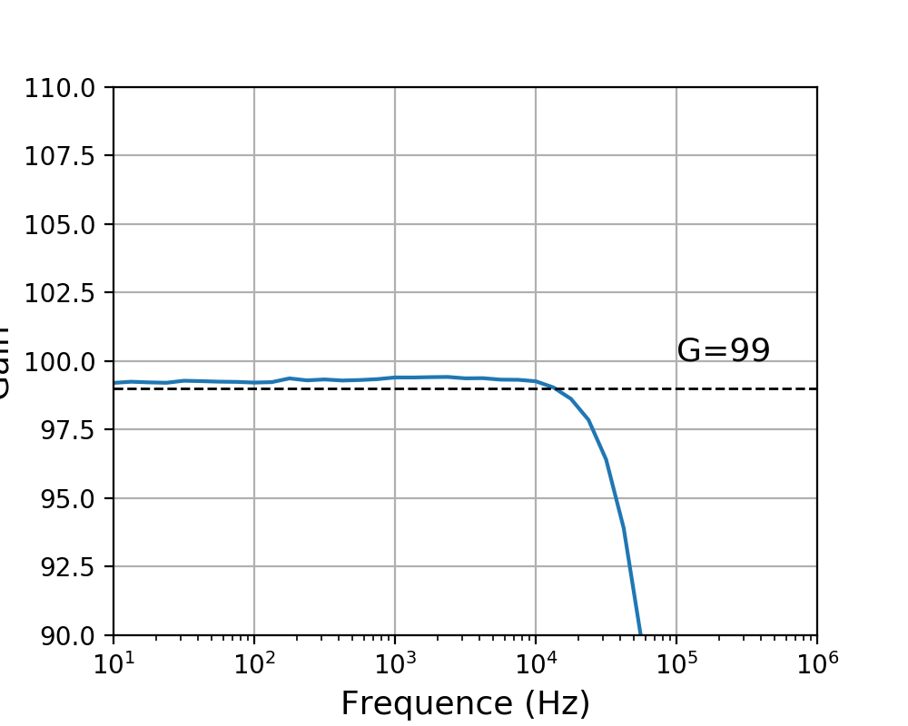

     - 说明：从上面两图来看，正负输入端的增益有微小差别，但不能由此来直接计算共模抑制比，认为该放大器的共模抑制比不好。

5. **ToDo**

   - 输入端增加滤波回路；
   - 输入端增加1M欧姆的并联电阻，使放大器的输入阻抗为1M欧；
   - 尝试通过更严谨的实验，测量其共模抑制比；

   

